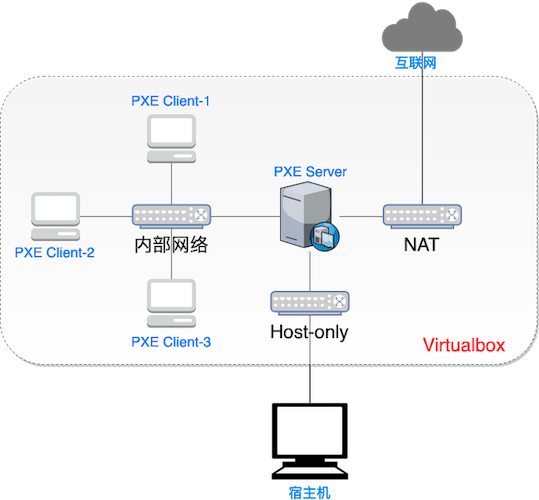
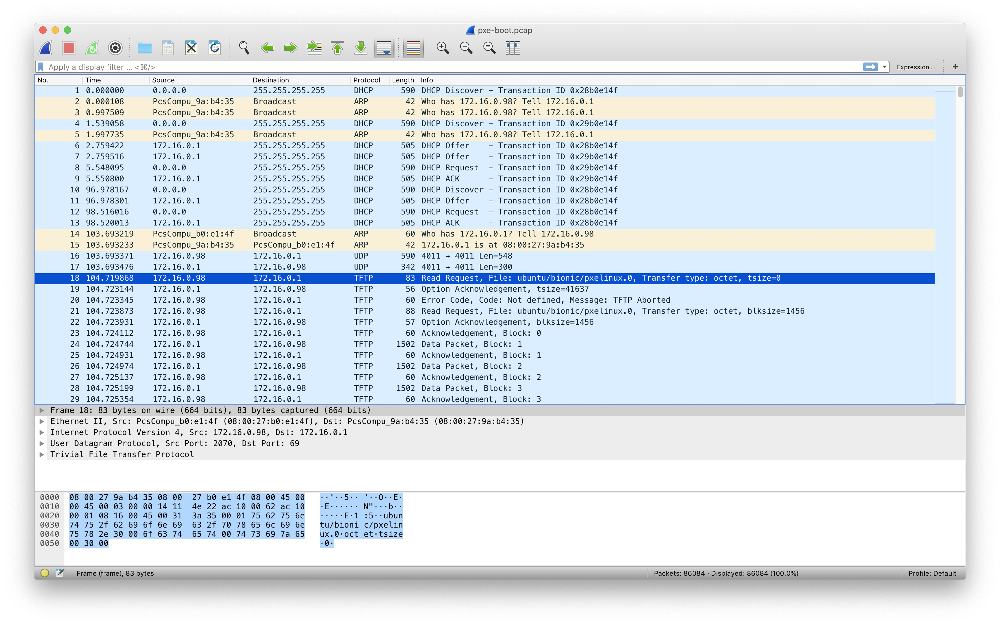
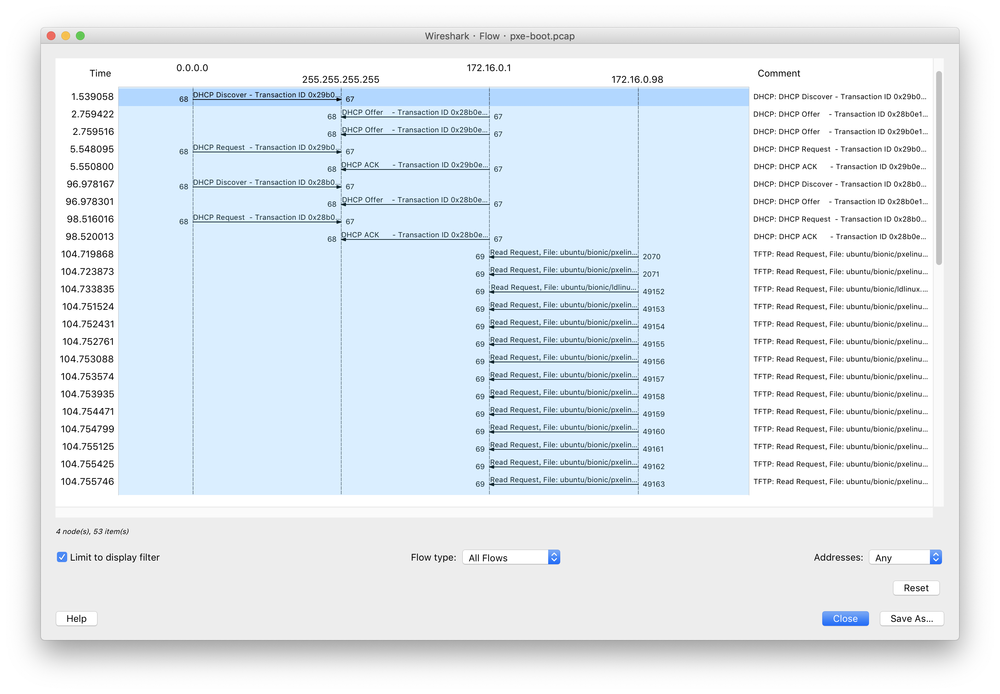
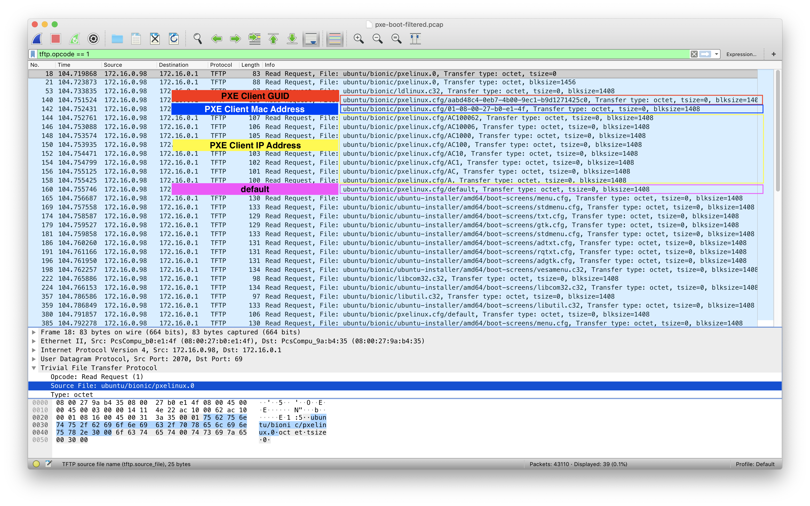
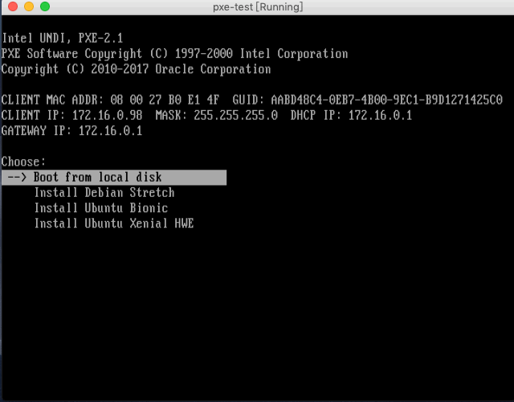
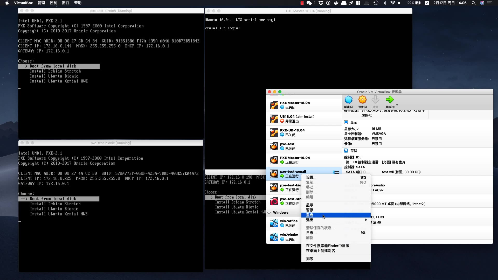

# 番外：PXE

---

# 从零到一 2.0 { id="pxe-intro" }

---

> 给「成百上千」台裸机安装操作系统

---

## PXE 基本概念

`PXE` - **P**reboot e**X**ecution **E**nvironment, 预启动执行环境

> Intel公司提出的一种使用网络接口启动计算机的机制，能够代替本地数据存储设备（光盘、硬盘、USB设备）进行安装操作系统。

目前，PXE 启动已成为一种[固件标准](http://www.pix.net/software/pxeboot/archive/pxespec.pdf)，大部分服务器BIOS都支持PXE启动，特别适合大规模集群批量、自动化、无人值守方式安装操作系统。

---

* PXE 工作基于「客户端/服务器」的网络模式

---

### 基于 PXE 安装操作系统的工作过程如下

* 客户端（裸机）设置 BIOS 开启「从网卡启动」
* 客户端网卡会发起 DHCP 请求分配 IP 地址
* DHCP 服务器处理返回分配的IP地址外，还返回预设网关、TFTP 服务器地址及引导程序 Bootstrap
    * 该文件是一种由 PXE 启动规范规定的固定格式的可执行文件，类似于开机启动项的「可执行文件」：并由此支持来自网络的操作系统的启动过程
    * Linux 系统为 `pxelinux.0`，[Windows 使用 PE 系统](https://docs.microsoft.com/zh-cn/windows/deployment/configure-a-pxe-server-to-load-windows-pe?ocid=tia-257895000)

---

* 客户端通过 TFTP（**T**rivial **F**ile **T**ransfer **P**rotocol）或 MTFTP（**M**ulticast **T**rivial **F**ile **T**ransfer **P**rotocol）协议下载 Bootstrap 的配置文件（例如 `pxelinux.cfg/default`）
* 客户端读取收到的配置文件，根据其中内容，再次请求 TFTP 传送内核映像文件和系统启动文件（例如 `initrd.gz`）
* 完成后开始启动内核，内核程序读取 Bootstrap 的配置文件，通过网络获取操作系统自动安装脚本（例如 `preseed.cfg`），并通过网络服务（NFS / FTP / HTTP）获得系统所需安装文件，按照自动安装脚本的配置进行安装


# 从实例学 PXE + 「无人值守」同时安装多台主机

---

## 网络拓扑 { id="network-1" }



---

## 网络拓扑 { id="network-2" }

* PXE 服务器和 PXE 客户端在同一个 **局域网**
* PXE 服务器上同时配置了（本例中由 **dnsmasq** 提供）
    * DHCP Server
    * PXE Server
    * TFTP Server
    * DNS Server（非必需）
    * HTTP Server（提供 `preseed.cfg` 下载，本例子中由 **apache2** 提供）

---

## 本例所用 PXE 服务器的自动安装配置 { id="pxe-configure" }

[c4pr1c3/AnsibleTutorial/pxeboot on Github](https://github.com/c4pr1c3/AnsibleTutorial/tree/master/pxe-boot)

* 关键配置
    * dnsmasq（TFTP 和 PXE 服务路径、多重启动菜单）
    * apache2（preseed.cfg 针对不同发行版系统定制下载 URL）
    * txt.cfg（针对不同发行版系统需要定制和调试内核启动参数）
    * preseed.cfg（针对不同发行版系统需要定制和调试人机交互选项的配置）
    * 提供 PXE 客户端访问互联网能力

---

## 通信过程抓包分析

[PXE Boot 过程（过滤掉了 TFTP 服务器返回的数据，仅保留「信令」通信过程数据）pcap 文件](images/pxe/pxe-boot-filtered.pcap)

---



---



---

### PXE 初始化过程 { id="pxe-boot-1" }

* 目标主机（包含 PXE 客户端）上电启动
* 目标主机的网卡发起 DHCP 请求
* DHCP 服务器响应目标主机的 DHCP 请求：网络配置信息（IP、子网掩码、网关、DNS等）和 TFP 服务器地址、**可启动镜像** 地址（ `pxelinux.0` ）
* 目标主机接收到上述响应信息后，访问 TFTP 服务器下载 **可启动镜像**
* TFTP 服务器发送 **可启动镜像** （`pxelinux.0`），目标主机执行下载的镜像启动系统

---

### PXE 配置文件下载策略 { id="pxelinux.cfg-search-1" }

默认情况下，`PXE 客户端` 在 `TFP 服务器` 的 `pxelinux.cfg` 子目录下 **按以下优先级次序** 搜索 `镜像启动配置文件`：

- 查询 `PXE 客户端` 所在主机的唯一标识 **GUID** 
    - 例如本例子中的 `aabd48c4-0eb7-4b00-9ec1-b9d1271425c0`
- 查无上述命名配置文件后，再查询 `PXE 客户端` 发起 DHCP 请求所使用网卡的 **MAC 地址** 
    - 例如本例子中的 `01-08-00-27-b0-e1-4f`

---

### PXE 配置文件下载策略 { id="pxelinux.cfg-search-2" }

- 查无上述命名配置文件后，再查询 `PXE 客户端` 通过 DHCP 响应获得到的 **IP 地址** （转换成 16 进制大写字母表示后，从右向左依次查询匹配）
    - 例如本例子中依次查询了 `AC100062`, `AC10006`, `AC1000`, `AC100`, `AC10`, `AC1`, `AC`, `A`
- 查无上述命名配置文件后，最后查询 `default`

---

IPv4 地址转换成 16 进制大写字母表示

```bash
IP="172.16.0.98"
printf '%02X' ${IP//./ }; echo
# AC100062 
```

---




---

## PXE 客户端启动过程



# 完整 PXE + 无人值守安装过程演示

---

[](https://www.bilibili.com/video/av43936728/)

# 小结

---

* PXE 首先是提供了裸机 **批量**、**自动化** 加载运行「最小化」系统的能力
* 「最小化」系统不仅可以是 Linux，也可以是其他操作系统的「最小化」版本
* 基于「最小化」系统内置的「无人值守安装配置」能力（例如 Debian/Ubuntu 使用的 `preseed` 技术）继续通过 **网络** 在线安装完整操作系统
    * 在「内网」搭建完整的在线安装系统 **镜像源** 可以大幅度缩短通过互联网在线安装系统的时间

## 参考资料

* [PXEBootInstall: Installing Debian using network booting](https://wiki.debian.org/PXEBootInstall)
* [dnsmasq on ArchLinux](https://wiki.archlinux.org/index.php/dnsmasq)
* [Understanding PXE Booting and Kickstart Technology](https://docs.oracle.com/cd/E24628_01/em.121/e27046/appdx_pxeboot.htm#EMLCM12199)


