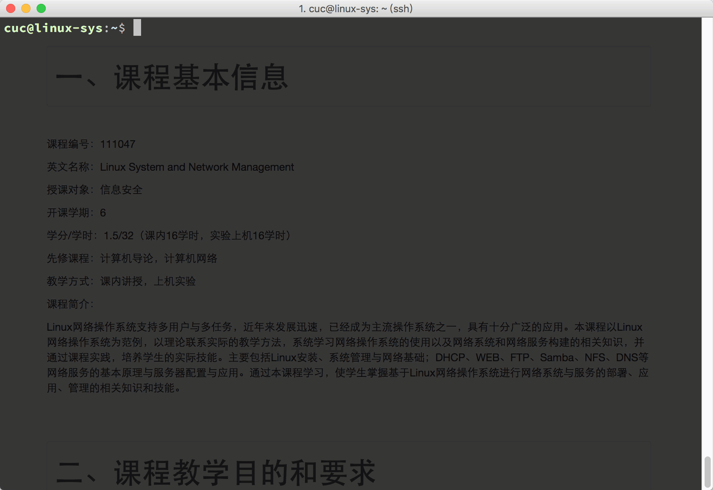
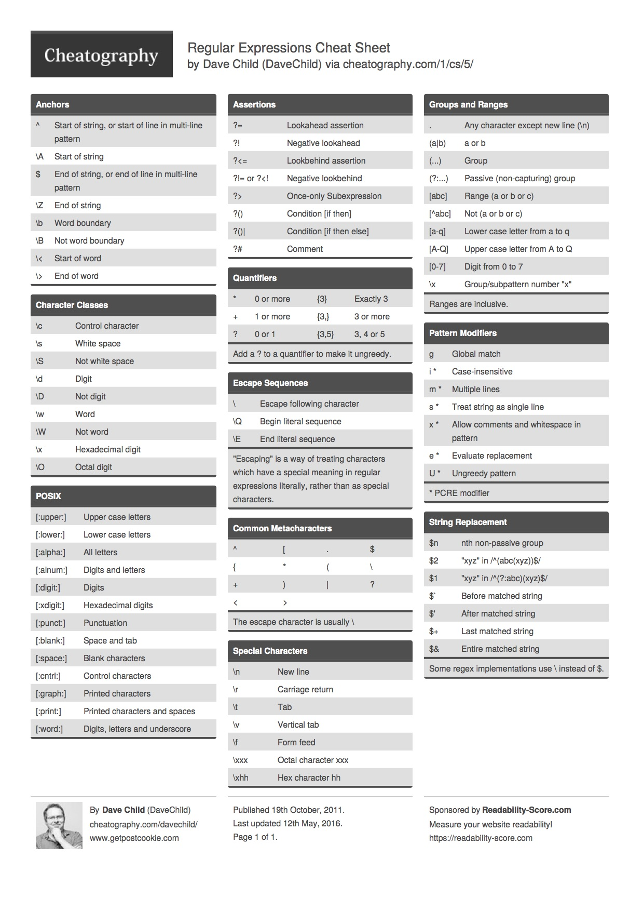
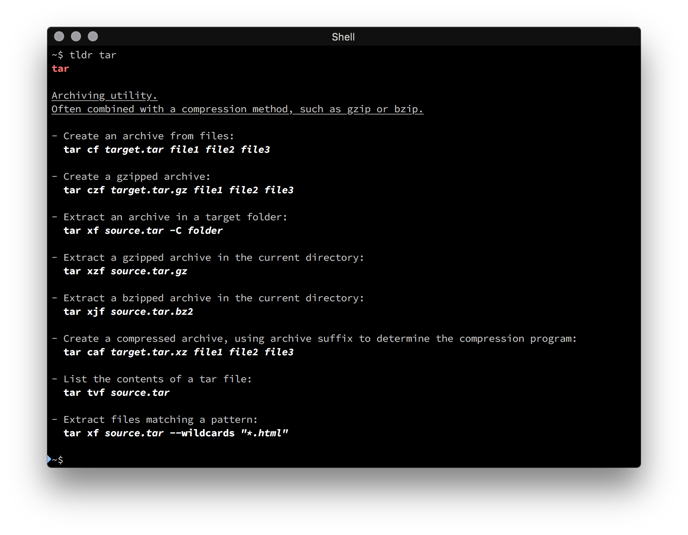

# 第二章：Linux服务器系统使用基础

---

## From GUI to CLI



# 软件包管理

---

* sources.list格式
* 小心添加第三方软件源
* 查找：apt-get update && apt-cache search、apt-file、google、dpkg -S、aptitude
* 安装：软件被装到哪里去了
* 升级：区分upgrade与dist-upgrade
* 卸载：purge、clean、remove
* 源码下载与安装
    * README.md / INSTALL 

---

sources.list范例——Ubuntu 16.04.1默认

```ini
#

# deb cdrom:[Ubuntu-Server 16.04.1 LTS _Xenial Xerus_ - Release amd64 (20160719)]/ xenial main restricted

#deb cdrom:[Ubuntu-Server 16.04.1 LTS _Xenial Xerus_ - Release amd64 (20160719)]/ xenial main restricted

# See http://help.ubuntu.com/community/UpgradeNotes for how to upgrade to
# newer versions of the distribution.
deb http://us.archive.ubuntu.com/ubuntu/ xenial main restricted
# deb-src http://us.archive.ubuntu.com/ubuntu/ xenial main restricted

## Major bug fix updates produced after the final release of the
## distribution.
deb http://us.archive.ubuntu.com/ubuntu/ xenial-updates main restricted
# deb-src http://us.archive.ubuntu.com/ubuntu/ xenial-updates main restricted

## N.B. software from this repository is ENTIRELY UNSUPPORTED by the Ubuntu
## team. Also, please note that software in universe WILL NOT receive any
## review or updates from the Ubuntu security team.
deb http://us.archive.ubuntu.com/ubuntu/ xenial universe
# deb-src http://us.archive.ubuntu.com/ubuntu/ xenial universe
deb http://us.archive.ubuntu.com/ubuntu/ xenial-updates universe
# deb-src http://us.archive.ubuntu.com/ubuntu/ xenial-updates universe

## N.B. software from this repository is ENTIRELY UNSUPPORTED by the Ubuntu
## team, and may not be under a free licence. Please satisfy yourself as to
## your rights to use the software. Also, please note that software in
## multiverse WILL NOT receive any review or updates from the Ubuntu
## security team.
deb http://us.archive.ubuntu.com/ubuntu/ xenial multiverse
# deb-src http://us.archive.ubuntu.com/ubuntu/ xenial multiverse
deb http://us.archive.ubuntu.com/ubuntu/ xenial-updates multiverse
# deb-src http://us.archive.ubuntu.com/ubuntu/ xenial-updates multiverse

## N.B. software from this repository may not have been tested as
## extensively as that contained in the main release, although it includes
## newer versions of some applications which may provide useful features.
## Also, please note that software in backports WILL NOT receive any review
## or updates from the Ubuntu security team.
deb http://us.archive.ubuntu.com/ubuntu/ xenial-backports main restricted universe multiverse
# deb-src http://us.archive.ubuntu.com/ubuntu/ xenial-backports main restricted universe multiverse

## Uncomment the following two lines to add software from Canonical's
## 'partner' repository.
## This software is not part of Ubuntu, but is offered by Canonical and the
## respective vendors as a service to Ubuntu users.
# deb http://archive.canonical.com/ubuntu xenial partner
# deb-src http://archive.canonical.com/ubuntu xenial partner

deb http://security.ubuntu.com/ubuntu xenial-security main restricted
# deb-src http://security.ubuntu.com/ubuntu xenial-security main restricted
deb http://security.ubuntu.com/ubuntu xenial-security universe
# deb-src http://security.ubuntu.com/ubuntu xenial-security universe
deb http://security.ubuntu.com/ubuntu xenial-security multiverse
# deb-src http://security.ubuntu.com/ubuntu xenial-security multiverse
```

---

sources.list格式说明

```bash
man sources.list
```

* xenial是Ubuntu 16.04的[官方版本代号](https://en.wikipedia.org/wiki/Ubuntu_version_history)

---

[软件包类型代号：关于main / restricted / universe / multiverse](https://help.ubuntu.com/community/Repositories/Ubuntu)

* Main - Canonical官方支持的免费和开源软件
* Universe - （开源）社区维护的免费和开源软件
* Restricted - 私有设备驱动
* Multiverse - 有版权限制的私有软件

以下是[Wikipedia的软件包分类和支持分类说明](https://en.wikipedia.org/wiki/Ubuntu_%28operating_system%29#Package_classification_and_support)

| | 免费软件 | 非免费软件 |
|--+----+-----|
|官方支持    | main   | restricted    |
|官方不支持（社区或第三方支持）  | universe   | multiverse    |

---

软件包类型代号：关于[backports](https://help.ubuntu.com/community/UbuntuBackports) / [partner](https://help.ubuntu.com/community/Repositories/Ubuntu#Enabling_Canonical_Partner_Repositories)

* backports  
    * 官方安全审查小组**不会**提供任何安全审查和安全性承诺保障
    * 向旧版本系统提供较新且兼容旧版系统和所有依赖关系的软件
* partner
    * 非Ubuntu系统的必要组件，是Canonical公司及其合作伙伴向Ubuntu用户提供的附加软件：通常是闭源和商业版权软件

---

举例讲解

```ini
deb http://us.archive.ubuntu.com/ubuntu/ xenial multiverse
```

**apt-get update**的过程是访问一个构造好的URL，该URL使用内置的字符串“拼接”规则构造成

```ini
http://us.archive.ubuntu.com/ubuntu/dists/xenial/multiverse/binary-amd64/
```

* 其中**binary-amd64**是根据当前系统是64位而“换算”得来的，如果是32位系统该位置字符串会被替换为**binary-i386**
* 当前发行版版本代号后面有不止一个软件包类型代号时，有几个软件包类型代号就对应会构造出几个实际的软件列表下载地址

---

**apt-get update** VS. **apt-get upgrade** VS. **apt-get dist-upgrade**

```bash
man apt-get
```

* **apt-get update** 使用/etc/apt/sources.list中定义的镜像源地址更新可用软件包列表，更新本地的可用软件包信息数据库文件，并不会“安装”或“更新”任何软件
* **apt-get upgrade** 根据本地的可用软件包信息数据库文件内容更新安装当前系统中所有已安装软件的版本
* **apt-get dist-upgrade** 在**apt-get upgrade**的基础上可以解决部分软件升级时需要卸载其他软件的自动依赖关系推导和解决问题，通常内核版本升级都需要通过该命令来实现

---

**apt-get remove** VS. **apt-get purge** VS. **apt-get clean**

* **apt-get remove** 删除已安装软件包但不删除配置文件
* **apt-get purge**  删除已安装软件包和配置文件
* **apt-get clean** 删除/var/cache/apt/archives/和/var/cache/apt/archives/partial/目录下除了lock文件之外的所有已下载（软件包）文件

---

**apt-get autoclean** VS. **apt-get autoremove**

* **apt-get autoclean**   和**apt-get clean**类似，但更“智能”，主要是为了清除无用缓存保留可能还有用的缓存用的
* **apt-get autoremove**  删除所有用于满足其他软件依赖关系而自动安装但现在已经没有软件依赖的软件包

---

## 查找你需要的软件包 ——  如果你知道软件包名

```bash
apt-get install <package_name>
```

---

## 查找你需要的软件包 ——  如果你知道软件名，但不知道软件包名

```bash
apt-cache search <software_keyword>
apt-get install <software_keyword><TAB><TAB>

# example
apt-cache search mysql
apt-cache search apache

# 利用终端的自动补全机制获得以mysql关键字开头的所有软件包名
apt-get install mysql<TAB><TAB>
```

* Google Knows!!!

---

apt-file - APT package searching utility -- command-line interface

```bash
apt-get install apt-file
man apt-file
```

> apt-file  is  a  command line tool for searching files in packages for the APT package management system.

---

aptitude - 对**apt-get**进行封装的一个更友好、更易用（主要体现在自动解决软件依赖bug上）包管理工具

```bash
apt-get install aptitude
man aptitude
```

```bash
$ aptitude show mysql-server
Package: mysql-server
State: not installed
Version: 5.7.16-0ubuntu0.16.04.1
Priority: optional
Section: database
Maintainer: Ubuntu Developers <ubuntu-devel-discuss@lists.ubuntu.com>
Architecture: all
Uncompressed Size: 106 k
Depends: mysql-server-5.7
Provided by: percona-server-server-5.6 (5.6.22-rel71.0-0ubuntu4), percona-server-server-5.6
             (5.6.22-rel71.0-0ubuntu4.1), percona-xtradb-cluster-server-5.6 (5.6.21-25.8-0ubuntu3),
             percona-xtradb-cluster-server-5.6 (5.6.21-25.8-0ubuntu3.2)
Description: MySQL database server (metapackage depending on the latest version)
 This is an empty package that depends on the current "best" version of mysql-server (currently
 mysql-server-5.7), as determined by the MySQL maintainers. Install this package if in doubt about which
 MySQL version you need. That will install the version recommended by the package maintainers.

 MySQL is a fast, stable and true multi-user, multi-threaded SQL database server. SQL (Structured Query
 Language) is the most popular database query language in the world. The main goals of MySQL are speed,
 robustness and ease of use.
Homepage: http://dev.mysql.com/

$ aptitude show aptitude
Package: aptitude
State: installed
Automatically installed: no
Multi-Arch: foreign
Version: 0.7.4-2ubuntu2
Priority: optional
Section: admin
Maintainer: Ubuntu Developers <ubuntu-devel-discuss@lists.ubuntu.com>
Architecture: amd64
Uncompressed Size: 4,205 k
Depends: aptitude-common (= 0.7.4-2ubuntu2), libapt-pkg5.0 (>= 1.1), libboost-iostreams1.58.0, libc6 (>=
         2.14), libcwidget3v5, libgcc1 (>= 1:3.0), libncursesw5 (>= 6), libsigc++-2.0-0v5 (>= 2.6.1),
         libsqlite3-0 (>= 3.6.5), libstdc++6 (>= 5.2), libtinfo5 (>= 6), libxapian22v5
Recommends: libparse-debianchangelog-perl, sensible-utils
Suggests: apt-xapian-index, aptitude-doc-en | aptitude-doc, debtags, tasksel
Conflicts: aptitude:i386
Provides: aptitude:i386 (= 0.7.4-2ubuntu2)
Provided by: aptitude:i386 (0.7.4-2ubuntu2)
Description: terminal-based package manager
 aptitude is a package manager with a number of useful features, including: a mutt-like syntax for matching
 packages in a flexible manner, dselect-like persistence of user actions, the ability to retrieve and
 display the Debian changelog of most packages, and a command-line mode similar to that of apt-get.

 aptitude is also Y2K-compliant, non-fattening, naturally cleansing, and housebroken.
Homepage: http://aptitude.alioth.debian.org/
```

---

## aptitude, apt-get, apt

整理自：[The Debian Administrator's Handbook](https://debian-handbook.info/browse/stable/sect.apt-get.html)

* CLI: ``apt-get`` 诞生最早；``apt`` 稍晚，改进了 ``apt-get`` 的一些设计缺陷，更简单易用，推荐优先使用
* GUI: ``synaptic``, ``aptitude``（也有 CLI 接口） 

---

## 在安装前如何确认软件包的版本、来源

```bash
# apt-cache policy <package-name>
# apt policy <package-name>
apt-cache policy mysql-server

mysql-server:
  Installed: (none)
  Candidate: 5.7.21-0ubuntu0.16.04.1
  Version table:
     5.7.21-0ubuntu0.16.04.1 500
        500 http://cn.archive.ubuntu.com/ubuntu xenial-updates/main amd64 Packages
        500 http://cn.archive.ubuntu.com/ubuntu xenial-updates/main i386 Packages
        500 http://security.ubuntu.com/ubuntu xenial-security/main amd64 Packages
        500 http://security.ubuntu.com/ubuntu xenial-security/main i386 Packages
     5.7.11-0ubuntu6 500
        500 http://cn.archive.ubuntu.com/ubuntu xenial/main amd64 Packages
        500 http://cn.archive.ubuntu.com/ubuntu xenial/main i386 Packages
```

---

## 安装指定版本的软件

```bash
# 根据 apt-cache policy 输出结果里当前软件包的所有候选版本号
# apt install <package>=<version>
# 默认总是安装最新版
sudo apt install mysql-server=5.7.11-0ubuntu6
```

---

## 软件被装到哪里去了

```bash
# 查找apache2软件包依赖哪些独立软件包（名）
$ apt-cache depends apache2

# 查看指定软件包（名）在系统上创建了哪些目录和文件
$ dpkg -L apache2

# 由于apt-get在安装一款软件包时会自动安装相关依赖的软件包
# 所以，通常还需要查看这些被自动依赖安装的软件包又在系统上创建了哪些目录和文件
$ dpkg -L apache2-data
$ dpkg -L apache2-bin
```

---

谨慎修改***/etc/apt/sources.list***和在***/etc/apt/sources.list.d/***下创建第三方镜像配置文件!!!

谨慎修改***/etc/apt/sources.list***和在***/etc/apt/sources.list.d/***下创建第三方镜像配置文件!!!

谨慎修改***/etc/apt/sources.list***和在***/etc/apt/sources.list.d/***下创建第三方镜像配置文件!!!

---

## 使用第三方镜像源的风险

* [发行版不匹配、发行版匹配但版本代号不匹配导致大量软件依赖关系出现错乱，无法修复、无法删除、无法安装软件](http://weibo.com/1651460060/A4L8xoRZQ)
    * 最大可能是：只能重装系统解决
* [第三方镜像源的软件篡改留后门、中间人劫持风险](http://weibo.com/1651460060/BrdV8lYYK)

---

## DEB软件包管理工具 —— dpkg

```bash
man dpkg
```

```
$ dpkg --help
Usage: dpkg [<option> ...] <command>

Commands:
  -i|--install       <.deb file name> ... | -R|--recursive <directory> ...
  -s|--status <package> ...        Display package status details.
  -p|--print-avail <package> ...   Display available version details.
  -L|--listfiles <package> ...     List files 'owned' by package(s).
  -l|--list [<pattern> ...]        List packages concisely.
  -S|--search <pattern> ...        Find package(s) owning file(s).
```

---

## 使用源代码方式（编译）安装

* 优先使用包管理器apt-get方式安装软件，避免使用源代码方式（编译）安装
    * python软件优先使用pip，ruby软件优先使用gem，php软件优先使用composer，nodejs软件优先使用npm，perl软件优先使用cpanm
* 推荐使用源代码下载来源
    * **apt-get source pkg**
    * 软件作者托管在github上的代码
* 动手操作之前一定要看README、INSTALL等说明文档
* 确保本地编译环境满足源代码安装的所有依赖条件
* 安装失败一定要仔细核对出错信息、出错日志，在Google中根据错误代码、错误关键字搜索解决方案

# 文件管理基本命令

---

* ls
* touch
* rm / shred
* ln
* find
* grep

---

## 文件管理

* 扩展名查找
* 通配符匹配
* 按文件大小
* 按文件更新时间早于、晚于、在日期之间
* 查找到匹配后执行
    * ``find ... -execdir xxx {} \``;

---

## 文本内容检索

* grep -i
* grep -A
* grep -c
* grep -E
* grep -v

# sed

---

SED的英文全称是**Stream EDitor**，它是一个简单而强大的文本解析转换工具，在1973-1974年期间由贝尔实验室的***Lee E. McMahon***开发。

***McMahon***创建了一个通用的行编辑器，最终变成为了SED。SED的很多语法和特性都借鉴了ed编辑器。设计之初，它就已经支持正则表达式，SED可以从文件中接受类似于管道的输入，也可以接受来自标准输入流的输入。

SED由自由软件基金组织（FSF）开发和维护并且随着GNU/Linux进行分发，因此，通常它也称作***GNU SED***。

---

## SED 典型用途

* 文本替换
* 选择性的输出文本文件
* 从文本文件的某处开始编辑
* 无交互式的对文本文件进行编辑等

---

## 工作流

* read：SED从输入流（文件，管道或者标准输入）中读取一行并且存储到它叫做**模式空间**（***pattern buffer***）的内部缓冲区
* execute：默认情况下，所有的SED命令都在**模式空间**中***顺序***的执行，除非指定了行的地址，否则SED命令将会在所有的行上依次执行
* display：发送修改后的内容到输出流。在发送数据之后，**模式空间**将会被清空。
* 在文件所有的内容都被处理完成之前，上述过程将会重复执行

---

### 管道 Pipe

> 回顾「第一章」实验中用到的这个命令里使用的操作符：| 

```bash
cd ~/cd && find . -type f -print0 | xargs -0 md5sum > md5sum.txt
```

---

上一页的例子中

* `-print0` 将标准输出中的多条记录使用 **NULL**（`\00`）字符拼接成一个「长字符串」一次性输出到「标准输出」
* 如果不使用 `xargs` 命令，`md5sum` 将把「管道操作符」左侧命令的「标准输出」当作自己的「标准输入」计算 MD5 散列值
* `xargs` 的 `-0` 参数将「标准输入」中的 **NULL** 字符视为「数组分隔符」来「解析」标准输入内容
* `xargs` 从「标准输入」中每解析出「一个参数」就按照构造好的 `命令+参数` 执行一次指定的命令（此处是 `md5sum [fileN]` ），直到「标准输入」被解析完毕

---

* **模式空间** 是一块活跃的缓冲区，在sed编辑器执行命令时它会保存待检查的文本
* 默认情况下，所有的SED命令都是在模式空间中执行，因此输入文件并不会发生改变
* 还有另外一个缓冲区叫做**保持空间**（***hold buffer***），在处理模式空间中的某些行时，***可以用保持空间来临时保存一些行***。在每一个循环结束时，SED将会移除模式空间中的内容，但是**保持空间**中的内容在所有的循环过程中是持久存储的。SED命令无法直接在该缓冲区中执行，因此SED允许数据在 **保持空间**和**模式空间**之间切换
* 初始情况下，**保持空间**和**模式空间**都是空的
* 如果没有提供输入文件，SED将会从标准输入接收请求
* 如果没有提供地址范围，默认情况下SED将会对所有的行进行操作

# SED实例one by one

---

将[网络安全2016模拟测试题](http://sec.cuc.edu.cn/huangwei/textbook/ns/exam/2016.html)另存到本地文件``exam.html``，接下来我们来用sed做一些实验：

```bash
# 以下命令类似于cat exam.html
# 两个单引号是要执行的SED命令
# exam.html是输入的文件名
sed '' exam.html

```

* 以上命令，SED将会读取exam.html文件中的一行内容存储到它的模式空间中，然后会在该缓冲区中执行SED命令。
* 在这里，没有提供SED命令，因此对该缓冲区没有要执行的操作，最后它会删除模式空间中的内容并且打印该内容到标准输出。

---

## 基础语法

```bash
# -n 默认情况下，模式空间中的内容在处理完成后将会打印到标准输出，该选项用于阻止该行为
# 使用单引号指定要执行的命令
sed [-n] [-e] 'command(s)' files 

# 指定了包含SED命令的脚本文件
sed [-n] -f scriptfile files

# 这两种方法也可以同时使用
```

---

```bash
# 删除exam.html文件的第3行和第5行
sed -e '3d' -e '5d' exam.html

# 小练习：新建一个命令文件用于实现上述等价效果的命令并构造一个SED命令去读取该命令文件执行该操作
```

---

## GNU选项

这些选项是GNU规范定义的，可能对于某些版本的SED（例如mac平台上的sed）并不支持。

```bash
-n， --quiet, --slient：与标准的-n选项相同
-e script，--expression=script：与标准的-e选项相同
-f script-file， --file=script-file：与标准的-f选项相同
-i[SUFFIX]，--in-place[=SUFFIX]：该选项用于对当前文件进行编辑，如果提供了SUFFIX的话，将会备份原始文件，否则将会覆盖原始文件
-r，--regexp-extended：该选项将启用扩展的正则表达式
-u， --unbuffered：指定该选项的时候，SED将会从输入文件中加载最少的数据，并且更加频繁的刷出到输出缓冲区。在编辑tail -f命令的输出，你不希望等待输出的时候该选项是非常有用的。
```

# 模式空间

---

对任何文件的来说，最基本的操作就是输出它的内容，为了实现该目的，在SED中可以使用``print``命令打印出模式空间中的内容。

```bash
# 对比以下3个命令的执行结果差异

sed '' exam.html

# 默认情况下，SED将会输出模式空间中的内容，另外，我们的命令中包含了输出命令p，因此每一行被打印两次。
sed 'p' exam.html

sed -n 'p' exam.html
```

---

## 行寻址

默认情况下，在SED中使用的命令会作用于文本数据的所有行。如果只想将命令作用于特定的行或者某些行，则需要使用**行寻址**功能。

在SED中包含两种形式的行寻址：

* 以数字形式表示的行区间
* 以文本模式来过滤行

基本语法格式

```bash
# 方括号不包含在输入命令序列之中
[address]command
```

---

### 数字方式的行寻址

```bash
# 只会对第3行进行操作
sed -n '3p' exam.html

# 输出2-5行
sed -n '2,5 p' exam.html

# 输出最后一行，使用正则表达式的元字符 $
sed -n '$ p' exam.html

# 输出第3行到最后一行（包括）之间的所有行
sed -n '3,$ p' exam.html

# M, +n 将会打印出从第M行开始的下n行（共计n+1行）
# 输出从第2行开始的下4行
sed -n '2,+4 p' exam.html

# 使用M~N的形式，它告诉SED应该处理M行开始的每N行
# 以下命令只输出文件中的奇数行
sed -n '1~2 p' exam.html
```

---

### 文本方式的行寻址

```bash
# 必须用正斜线将要指定的pattern封起来。sed编辑器会将该命令作用到包含指定文本模式的行上。
/pattern/command
```

---

```bash
# 输出匹配script关键字的行
sed -n '/script/p' exam.html

# 模式匹配也可以与数字形式的寻址同时使用
# 下面的示例会从第一次匹配到script开始输出，直到最后一行为止
sed -n '/script/, $p'  exam.html

# 使用逗号（,）操作符指定匹配多个匹配的模式
# 下列的示例将会输出script和gitbook之间的所有行
sed -n '/script/, /gitbook/p'  exam.html

# 在使用文本模式过滤器的时候，与数字方式的行寻址类似，可以使用加号操作符 +，它会输出从当前匹配位置开始的某几行，下面的示例会从每一次script出现的位置开始输出接下来的4行
sed -n '/script/, +4p'  exam.html
```

# SED基本命令 {id="sed-commands"}

---

删除命令 d

```bash
[address1[,address2]]d 
```

``address1``和``address2``是开始和截止地址，它们可以是行号或者字符串匹配模式，这两种地址都是可选的。

由命令的名称可以知道，delete 命令是用来执行删除操作的，并且因为SED是基于行的编辑器，因此我们说该命令是用来删除行的。注意的是，该命令只会移除模式空间中的行，这样该行就不会被发送到输出流，但原始内容不会改变。

---

```bash
# 删除所有行，输出为空
sed 'd' exam.html

# 删除第4行，输出只缺少了第4行
sed '4d' exam.html

# 删除第2-4行
sed '2, 4 d' exam.html

# 指定模式匹配作为地址
# 删除所有包含script关键字的行
sed '/script/d' exam.html

# 删除包含script和gitbook关键字之间（包括匹配行）的所有行
# 只要匹配script就开始删除，直到遇到gitbook关键字匹配才停止删除操作
sed '/script/,/gitbook/d' exam.html
```

---

文件写入命令 w

SED提供了 write 命令用于将模式空间中的内容写入到文件，与 delete 命令类似，下面是 write 命令的语法

```bash
# 在 w 和 file 之间只能有一个空格
[address1[,address2]]w file 
```

w 指定是写命令， file 指的是存储文件内容的文件名。使用 file 操作符的时候要小心，当提供了文件名但是文件不存在的时候它会自动创建，如果已经存在的话则会**覆盖**原文件的内容。

---

```bash
# 把所有包含script关键字的行另存为script.txt
sed -n '/script/w script.txt' exam.html
```

---

追加命令 a

```bash
[address]a Append text 

# 以下格式利用的是bash的续行符特性
[address]a\ 
Append text 
```

在匹配成功之后下一行追加文本。

---

行替换命令 c

SED通过 c 提供了 change 和 replace 命令，该命令帮助我们使用新文本替换已经存在的行，当提供行的地址范围时，所有的行都被作为一组被替换为单行文本

```bash
[address1[,address2]]c\ 
Replace text
```

---

插入命令 i

插入命令与追加命令类似，唯一的区别是插入命令是在匹配的位置前插入新的一行。

```bash
[address1[,address2]]i\ 
Replace text
```

---

转换命令 y

转换（Translate）命令 y 是唯一可以处理单个字符的sed编辑器命令。转换命令格式 如下

```bash
[address]y/inchars/outchars/
```

转换命令会对inchars和outchars值进行一对一的映射。inchars中的第一个字符会被转换为outchars中的第一个字符，第二个字符会被转换成outchars中的第二个字符。这个映射过程会一直持续到处理完指定字符。如果inchars和outchars的长度不同，则sed编辑器会产生一条错误消息。

```bash
echo "2017 u can u up" | sed 'y/ucanp/UCANP/'
```

---

输出隐藏字符命令 l

你能通过直接观察区分出单词是通过空格还是tab进行分隔的吗？显然是不能的，但是SED可以为你做到这点。使用l命令（英文字母L的小写）可以显示文本中的隐藏字符（例如\t或者$字符）。

```bash
[address1[,address2]]l 
[address1[,address2]]l [len] 
```

```bash
echo -e "hello\tworld\n"
echo -e "hello\tworld\n" | sed -n 'l'
# 使用l命令的时候，一个很有趣的特性是我们可以使用它来实现文本按照指定的宽度换行。
echo -e "hello\tworld\n" | sed -n 'l 8'
# 上面的示例中在l命令后跟了一个数字8，它告诉SED按照每行8个字符进行换行，如果指定这个数字为0的话，则只有在存在换行符的情况下才进行换行。
```

---

退出命令 q

在SED中，可以使用Quit命令退出当前的执行流

```bash
[address]q 

# q命令也支持提供一个value，这个value将作为程序的返回代码返回
[address]q [value]
```

需要注意的是，q命令不支持地址范围，只支持单个地址匹配。默认情况下SED会按照读取、执行、重复的工作流执行，但当它遇到q命令的时候，它会退出当前的执行流。

---

文件读取命令 r

在SED中，我们可以让SED使用Read命令从外部文件中读取内容并且在满足条件的时候显示出来。

```bash
[address]r file
```

需要注意的是，r命令和文件名之间必须只有一个空格。

---

```bash
echo -e "hello\tworld\n" > junk.txt

# 以下示例在exam.html的行尾追加junk.txt的内容
sed '$ r junk.txt' exam.html
```

r命令也支持地址范围，例如``3, 5 r junk.txt``会在第三行，第四行，第五行后面分别插入junk.txt的内容

---

执行外部命令 e

⚠️ 此处要小心“**代码注入**”风险！！！

```bash
[address1[,address2]]e [command]
```

```bash
# 下面的命令会在第三行之前执行date命令
sed '3 e date' exam.html

# ⚠️  在没有提供外部命令的时候，SED会将模式空间中的内容作为要执行的命令。
echo -e "date\ncal\nuname" | sed 'e'

```

---

排除命令 !

感叹号命令（**!**）用来排除命令，也就是让原本会起作用的命令不起作用。

```bash
echo -e "hello\nworld\n" | sed -n '/hello/p' 

# p命令原先是只输出匹配hello的行，添加!之后，变成了只输出不匹配hello的行。
echo -e "hello\nworld\n" | sed -n '/hello/!p'
```

# 其它SED常用命令 {id="sed-common-cmds"}

---

n - 单行next

小写的n命令会告诉sed编辑器移动到数据流中的下一文本行，并且覆盖当前模式空间中的行。

v - SED版本检查

v命令用于检查SED的版本，如果版本大于参数中的版本则正常执行，否则失败

```bash
[address1[,address2]]v [version]
```

```bash
$ sed --version                                                                                                                                        ⏎
sed (GNU sed) 4.2.2

$ sed 'v 5' exam.html
sed: -e expression #1, char 3: expected newer version of sed
```

# SED特殊字符 {id="sed-specials"}

---

在SED中提供了两个可以用作命令的特殊字符：``=`` 和 ``&`` 。

---

## =

``=``命令用于输出行号，语法格式为

```bash
[/pattern/]= 

[address1[,address2]]=
```

---

```bash
# 匹配script的输出行号
sed '/script/ =' books2.txt

sed -n '/script/ =' books2.txt

# 对比以上命令的输出结果
sed -n '/script/=; /script/p' exam.html

# 输出文件的总行数
sed -n '$ =' exam.html
```

---

## &

特殊字符``&``用于存储匹配模式的内容，通常与替换命令``s``一起使用。

```bash
echo -e "1) A Storm of Swords, George R. R. Martin, 1216 
2) The Two Towers, J. R. R. Tolkien, 352 
3) The Alchemist, Paulo Coelho, 197 
4) The Fellowship of the Ring, J. R. R. Tolkien, 432 
5) The Pilgrimage, Paulo Coelho, 288 
6) A Game of Thrones, George R. R. Martin, 864" > books.txt

sed 's/[[:digit:]]/Book number &/' books.txt
sed 's/[[:digit:]]* *$/Pages = &/' books.txt
```

# SED字符串操作 {id="sed-strings"}

---

替换命令 **s**

文本替换命令非常常见，其格式如下

```bash
[address1[,address2]]s/pattern/replacement/[flags]
```

---

```bash
# 在SED中，使用替换命令的时候默认只会对第一个匹配的位置进行替换。
sed 's/,/ |/' books.txt

# 使用g选项告诉SED对所有内容进行替换：
sed 's/,/ |/g' books.txt

# 如果对匹配模式（或地址范围）的行进行替换，则只需要在s命令前添加地址即可。比如只替换匹配The Pilgrimage的行：sed '/The Pilgrimage/ s/,/ | /g' books.txt
```

---

还有一些其它的选项，这里就简单的描述一下，不在展开讲解

* 数字n: 只替换第n次匹配，比如``sed 's/,/ | /2' books.txt``，只替换每行中第二个逗号
* p：只输出改变的行，比如``sed -n 's/Paulo Coelho/PAULO COELHO/p' books.txt``
* w：存储改变的行到文件，比如``sed -n 's/Paulo Coelho/PAULO COELHO/w junk.txt' books.txt``
* i：匹配时忽略大小写，比如``sed -n 's/pAuLo CoElHo/PAULO COELHO/pi' books.txt``

---

* 在执行替换操作的时候，如果要替换的内容中包含``/``，这个时候怎么办？很简单，添加转义操作符``\``。
* 在SED中还可以使用``|``，``@``，``^``，``#``作为命令的分隔符

---

## 匹配子字符串

在SED中，使用``\(``和``\)``对匹配的内容进行分组，使用``\N``的方式进行引用。请看下面示例

```bash
echo "Three One Two" | sed 's|\(\w\+\) \(\w\+\) \(\w\+\)|\2 \3 \1|'
One Two Three
```

# 正则表达式

---

<a href="images/chap0x02/davechild_regular-expressions.bw.jpg"></a>

# SED Quick Reference

---

* [Google: sed思维导图](https://www.google.com/#newwindow=1&q=sed+%E6%80%9D%E7%BB%B4%E5%AF%BC%E5%9B%BE)
* [sed单行常用脚本](http://sed.sourceforge.net/sed1line_zh-CN.html)

# 社区驱动的「脱水版」帮助手册

---

[tldr: To Long, Don't Read](https://github.com/tldr-pages/tldr)

> 跟着「范例」学命令

---



# 文本内容查找替换神器之AWK

---

* [HANDY ONE-LINE SCRIPTS FOR AWK](http://www.pement.org/awk/awk1line.txt)

# 其他文本内容处理小工具

---

* head / tail
* cut
    * ``cut -d ":" -f 1,6 /etc/passwd``
* tr
    * ``echo "hello world" | tr [:lower:] [:upper:]``
    * ``echo "hello world" | tr -d hello``

# 一些文本处理的任务

---

* 查找并统计某函数在整个“项目”中被调用次数，并输出在哪些文件、具体那些行中调用到了该函数
* 在整个目录中查找某关键词出现在哪些文件的哪些行
* 删除C语言编写项目中的所有注释行

# 别名机制 - alias

---

```bash
# 查看当前shell环境中已定义的别名有哪些
alias
# 注意alias不是一个外部命令（文件），而是bash的一个内置函数
man alias
# 在bash的手册页中去搜索alias
man bash
```

# [文件压缩与解压缩](https://www.cyberciti.biz/howto/question/general/compress-file-unix-linux-cheat-sheet.php)

---

* gzip
* bzip2
* zip
* ***tar***
* 7z (p7zip)
* rar (p7zip-rar / unrar-free)
    * rar是私有压缩算法格式，Linux平台只支持解压缩

---

[Linux 下 zip 文件解压乱码如何解决？](https://www.zhihu.com/question/20523036)

<a href="https://asciinema.org/a/d81fdjlf83ecltrpewh4tg4hj" target="_blank"></a>

# 进程管理

---

* ps aux
* pstree
* pidof
* top
    * 运行时性能分析利器
* htop
    * 改进的交互式系统信息查看器
* kill / kill -9 / kill -s N / killall ``<process_imagename>``

---

## 子进程管理

* 将进程放到“后台”运行：   &
* Bash内置的2个进程管理函数：bg / fg

```bash
# 执行以下ping命令后终端所有操作被“无视忽略掉”
ping www.baidu.com
# 直到使用CTRL-C快捷键组合输入，可以终止该ping进程
CTRL-C
# 我们试着把ping进程放到“后台”执行
ping www.baidu.com &
# 此时终端不断被“涌出”的ping输出结果“污染”
# 此时CTRL-C无效
CTRL-C
# 以下“2连击”可以终止该ping进程
fg
CTRL-C
# 我们再试着把ping进程放到“后台”执行，这一次我们把标准错误输出先重定向到标准输出，然后再把标准输出重定向到“黑洞”文件
ping www.baidu.com 1>/dev/null 2>&1 &
# 整个世界都清净了，终端不会再被“涌出”的ping输出结果“污染”
# 查看进程会发现ping在“后台”一直运行着
ps aux | grep ping
ping sec.cuc.edu.cn 1>/dev/null 2>&1 &
# 杀死所有ping进程
killall ping
```

---

## 子进程管理实验Live Demo

* 注意CTRL-Z的作用，被CTRL-Z的进程在***ps aux***中的进程状态如何显示的

<a href="https://asciinema.org/a/f3ux5ogwbxwo2q0wxxd0hmn54" target="_blank"></a>

---

## 关于输出重定向

```bash
man bash
# search "Redirecting Standard Output and Standard Error"
```

# 目录管理

---

* man hier
* ls
* mkdir / mkdir -p
* rm -rf、 rmdir
* ``~`` / . / .. / -
* /proc

# 环境变量

---

* ``$PATH``
* ``$HOME``、``$PWD``
* /etc/profile
* ``~/.bashrc、~/.profile``

# 网络调试

---

* arp
* ifconfig
* ip
* route
* netstat
* lsof

---

## 网络调试常见第三方工具

* ethtool
* dstat
* mtr
* traceroute
* tcpdump

---

## 相关重要配置文件

* /etc/hosts
* /etc/resolv.conf
* /etc/network/interfaces
* /etc/network/if-up.d、if-post-down.d、if-pre-up.d、if-down.d

# 提问的智慧 - 描述你的环境

---

自己回答以下问题（软件相关）

* 操作系统发行版和内核信息
* 系统中当前有谁在线
* 现在在运行的进程有哪些
* 哪些进程在监听哪些端口
* 挂载点和文件系统
* 已安装应用软件列表、故障或问题发生前最近新安装的软件信息
* 系统环境变量、当前用户环境变量

---

自己回答以下问题（软件相关进阶问题）

* 故障/问题发生前后邻近的系统日志、应用程序日志等
* 系统自启动项有哪些，自启动机制分别是什么；系统定时任务有哪些，触发机制分别是什么
* 出问题应用程序的当前环境变量设置情况等
* 当前系统中哪些应用程序/进程在占用网络带宽？

---

自己回答以下问题（软件相关高级问题）

如果能初步判断出问题的关联应用程序，那么首先建议阅读应用程序官方的bug报告指南，然后尽力去收集：

* 疑似出问题应用程序的
    * 版本信息、编译方式、安装方式等
    * 已加载第三方模块信息、依赖的第三方lib版本信息
    * 完整或能复现问题的最小化配置文件
    * 调试模式的运行、启动日志
    * 第三方性能分析、调试工具的分析、调试日志

---

自己回答以下问题（网络相关）

* 系统的IP地址、MAC地址信息
* ARP表 / 路由表 / hosts文件配置 / DNS服务器配置 / 代理服务器配置
* 防火墙规则表

---

自己回答以下问题（硬件相关）

* 硬件品牌、型号、购买渠道等
* CPU/内存/硬盘/网卡/外设和主要接口等硬件参数信息（例如是否使用了RAID？）
* 联网信息，例如使用的宽带接入方式、上下行带宽、运营商信息等

---

## 提问的智慧 - 使用自动化的工具描述你的环境

```bash
# 获得硬件信息
report-hw

# reportbug 需要另行安装

reportbug
# *** ERROR: "Ubuntu" BTS is currently unsupported. Please use "ubuntu-bug" (from the apport package) for reporting bugs in Ubuntu. You can report bugs to Debian by
# specifying 'bts debian' in your ~/.reportbugrc or by passing the -B debian option on the commandline (see reportbug(1)).

reportbug --template --bts debian -S normal vim

# 将指定软件的相关信息保存到本地而不是直接提交给软件作者
sudo ubuntu-bug openssh-server --save openssh-server.bug
```

---

* 目标应用程序官方提供的故障诊断工具运行日志
* [An Eye on your system](https://nicolargo.github.io/glances/)

# 参考文献

---

* [EnvironmentVariables from Ubuntu Official Documentation](https://help.ubuntu.com/community/EnvironmentVariables)
* [在服务器上排除问题的头五分钟](http://blog.jobbole.com/36375/)
* [My First 10 Minutes on a Server](https://news.ycombinator.com/item?id=11909543)
* [提问的智慧](https://github.com/ryanhanwu/How-To-Ask-Questions-The-Smart-Way/blob/master/README-zh_CN.md)
* [ReportingBugs Tutorial by Ubuntu Official Documentation](https://help.ubuntu.com/community/ReportingBugs)
* [DebuggingProcedures Tutorial by Ubuntu Official Documentation](https://wiki.ubuntu.com/DebuggingProcedures)
* [三十分钟学会SED](http://www.ituring.com.cn/article/273760)


