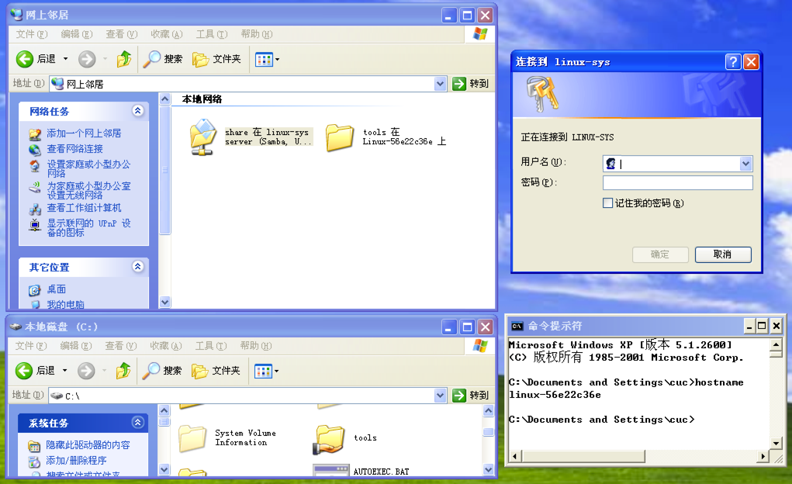

# 第六章：网络资源共享

---

## Keep Things Shared and Synchronized

# 经典文件共享服务

---

* FTP
* NFS
* SMB/CIFS

# [FTP](https://help.ubuntu.com/lts/serverguide/ftp-server.html.en)

---

> File Transfer Protocol (FTP) is a TCP protocol for downloading files between computers. In the past, it has also been used for uploading but, as that method does not use encryption, user credentials as well as data transferred in the clear and are easily intercepted. 

* 计算机之间**下载**文件之用
* 明文数据传输，易被拦截（篡改）
* **客户端/服务器**通信模型

---

常见FTP服务器软件

* ftpd
* vsftpd
* proftpd
* pure-ftpd

```bash
apt-cache show ftpd vsftpd proftpd-basic pure-ftpd | grep -A 5 Description-en

# ftpd: File Transfer Protocol (FTP) server This is the netkit ftp server. You are recommended to use one of its alternatives, such as vsftpd, proftpd, or pure-ftpd

# vsftpd: lightweight, efficient FTP server written for security This package provides the "Very Secure FTP Daemon", written from the ground up with security in mind.

# proftpd: Versatile, virtual-hosting FTP daemon - binaries ProFTPD is a powerful modular FTP/SFTP/FTPS server

# pure-ftpd: Secure and efficient FTP server Free, secure, production-quality and standard-conformant FTP server.
```

---

比较&选择？

Google: ftpd vsftpd proftpd pure-ftpd comparison

一些可供参考的评价因素：

* 功能特性是否满足需求
* 性能和可扩展性是否满足需求
* 安全性
    * [ftpd](https://www.cvedetails.com/product/9804/Ftpd-Ftpd.html?vendor_id=5802) / [vsftpd](https://www.cvedetails.com/product/3475/Beasts-Vsftpd.html?vendor_id=2041) / [proftpd](https://www.cvedetails.com/product/353/Proftpd-Project-Proftpd.html?vendor_id=204) / [pure-ftpd](https://www.cvedetails.com/vendor/2152/Pureftpd.html)

---

[《移动互联网安全》内容闪回](https://c4pr1c3.github.io/cuc-mis/chap0x05/main.html#%E7%B3%BB%E7%BB%9F%E5%AE%89%E5%85%A8%E8%AF%84%E4%BC%B0%E6%96%B9%E6%B3%95) 和 [《网络安全》内容闪回](https://c4pr1c3.github.io/cuc-ns/chap0x02/main.html#246-cvss-%E7%9A%84%E5%B1%80%E9%99%90%E6%80%A7%E5%92%8C%E4%B8%8D%E8%B6%B3)

* 评价一个系统、一款软件是否安全可以根据其历史漏洞数量、危害性统计来判定？
    * 历史漏洞数量越多、历史漏洞中高危漏洞数量越多说明这款软件的开发团队安全能力越差？
* 以资产(价值)为研究对象的风险评估模型是如何阐述：资产（价值）、威胁、漏洞、风险、安全措施之间的关系的？

---

### 5W2H 理论指导技术方案选型 (1/2)

* What 功能特性列表、安全特性列表
* Why  需求优先级列表：功能和需求一次性匹配度（减少二次开发成本）、易用性、易维护性、性能、价格（一次性买断 or 订阅持续付费），孰先孰后？
* Who  项目的发起和维护者是谁？商业公司 or 开源社区 or 个人？
* Where 成功案例都有哪些？是否开源？不适合的场景有哪些？

---

### 5W2H 理论指导技术方案选型 (2/2)

* When 项目的最近一次更新时间？项目历史？
* How  项目技术栈？是否和当前需求场景使用的主要技术栈集成？
* How Much 性能？开发成本（人力投入、时间投入、授权费用、依赖软硬件采购费用等）

# FTP服务器配置任务 {id="ftp-configuration-task"}

---

请自行根据以下任务需求从以上FTP服务器软件中选择一款满足所有任务要求的FTP服务器进行安装配置实验

* [ ] 配置一个提供匿名访问的FTP服务器，匿名访问者可以访问1个目录且仅拥有该目录及其所有子目录的只读访问权限；
* [ ] 配置一个支持用户名和密码方式访问的账号，该账号继承匿名访问者所有权限，且拥有对另1个独立目录及其子目录完整读写（包括创建目录、修改文件、删除文件等）权限；
    * 该账号仅可用于FTP服务访问，不能用于系统shell登录；

***to be continued*** ...

---

***resumed***

* [ ] FTP用户不能越权访问指定目录之外的任意其他目录和文件；
* [ ] 匿名访问权限仅限白名单IP来源用户访问，禁止白名单IP以外的访问；
* [ ] （可选加分任务）使用FTPS服务代替FTP服务，上述所有要求在FTPS服务中同时得到满足；

# [NFS](https://help.ubuntu.com/16.04/serverguide/network-file-system.html)

---

NFS允许系统将其目录和文件共享给网络上的其他系统。通过NFS，用户和应用程序可以像访问本地文件一样访问远程系统上的文件。

---

## NFS服务器配置任务 {id="nfs-config-task"}

* [ ] 在1台Linux上配置NFS服务，另1台电脑上配置NFS客户端挂载2个权限不同的共享目录，分别对应只读访问和读写访问权限；
* [ ] 实验报告中请记录你在NFS客户端上看到的：
    * 共享目录中文件、子目录的属主、权限信息
    * 你通过NFS客户端在NFS共享目录中新建的目录、创建的文件的属主、权限信息
    * 上述共享目录中文件、子目录的属主、权限信息和在NFS服务器端上查看到的信息一样吗？无论是否一致，请给出你查到的资料是如何讲解NFS目录中的属主和属主组信息应该如何正确解读

***to be continued*** ...

---

***resumed***

* [ ] （可选加分任务）在客户端或NFS服务器上抓包分析使用NFS协议时的远程文件下载、上传、移动、删除等操作是否是明文？远程的文件传输数据流是否可以被恢复出完整的传输文件？
    * 提示：我们在《网络安全》第4章《网络监听》中介绍过的工具filesnarf

# SMB/CIFS {id="smbcifsheading"}

---

## SMB/CIFS —— 🌰



---

## [SMB与CIFS的关系](https://msdn.microsoft.com/zh-cn/library/windows/desktop/aa365233\(v=vs.85\).aspx)

> The Server Message Block (SMB) Protocol is a network file sharing protocol, and as implemented in Microsoft Windows is known as Microsoft SMB Protocol. The set of message packets that defines a particular version of the protocol is called a dialect. The Common Internet File System (CIFS) Protocol is a dialect of SMB. Both SMB and CIFS are also available on VMS, several versions of Unix, and other operating systems.

---

CIFS协议是SMB协议的一个本地化实现（dialect，直译为“方言”)，协议设计的初衷是文件共享，但微软的SMB协议还提供了一些额外功能：

* Dialect negotiation
* Determining other Microsoft SMB Protocol servers on the network, or network browsing
* Printing over a network
* File, directory, and share access authentication
* File and record locking
* File and directory change notification
* Extended file attribute handling
* Unicode support
* Opportunistic locks

---

* 按照OSI网络模型，微软SMB协议常被归类到应用层或表示层协议。
* 微软SMB数据传输通常使用NetBIOS over TCP/IP (NBT)，但仅仅是为了后向兼容性需要。实际上，这并不是SMB协议唯一的传输层协议选择。
* 微软SMB协议采用**客户端-服务器**模式实现，由一系列客户端请求和服务器响应数据构成：
    * 会话控制报文—和共享服务资源建立和断开连接
    * 文件访问报文—访问和控制远程服务器上文件和目录
    * 通用消息报文—发送数据到打印队列、邮件投递接口、命名管道，并提供打印队列状态信息

某些数据报文会分组打包在一次数据传输中以降低响应延迟和提高带宽利用率，这种方法被称为“批处理”。

# Samba {id="sambaheading"}

---

> [为Windows环境提供和整合常用服务](https://help.ubuntu.com/lts/serverguide/samba-introduction.html)

* **文件和打印机共享服务**。SMB协议可以使在网络上共享文件、文件夹、卷和打印机变得容易。
* **目录服务**。通过 LDAP(Lightweight Directory Access Protocol，轻量目录访问协议) 和 Microsoft Active Directory® 技术来共享网络计算机和用户的重要信息。
* **认证和权限**。建立网络计算机和用户的身份信息，并通过使用文件权限、组策略和 Kerberos 认证服务等原理和技术来确定计算机或用户可以访问的信息。

---

## [安装和配置Samba独立共享服务器](https://wiki.samba.org/index.php/Setting_up_Samba_as_a_Standalone_Server)

* Linux设置匿名访问共享目录
* Linux设置用户名密码方式的共享目录

```bash
# 安装Samba服务器
sudo apt-get install samba

# 创建Samba共享专用的用户
sudo useradd -M -s /sbin/nologin demoUser
sudo passwd demoUser
# 创建的用户必须有一个同名的Linux用户，密码是独立的
sudo smbpasswd -a demoUser
```

---

```ini
# 在/etc/samba/smb.conf 文件尾部追加以下“共享目录”配置
[demo]
        path = /srv/samba/demo/
        read only = no
        guest ok = no
        force create mode = 0660
        force directory mode = 2770
        force user = demoUser
        force group = demoGroup
# Forced Parameters 可以强制所有连接共享目录的用户创建的文件、目录使用特定的权限位设定、属主用户和属主组（有安全风险）
```

---

smbclient

```bash
sudo apt-get install smbclient
```

* Linux访问Windows的匿名共享目录
* Linux访问Windows的用户名密码方式共享目录
* [下载整个目录](https://indradjy.wordpress.com/2010/04/14/getting-whole-folder-using-smbclient/)

# 移动互联时代的文件共享

---

* [owncloud](https://owncloud.org/)
* [seafile](https://www.seafile.com/home/)
* [Syncthing](https://syncthing.net/)

# 参考文献

---

* [FTP Server from Ubuntu Official Documentation](https://help.ubuntu.com/lts/serverguide/ftp-server.html)
* [How To Set Up an NFS Mount on Ubuntu 16.04](https://www.digitalocean.com/community/tutorials/how-to-set-up-an-nfs-mount-on-ubuntu-16-04)
* [Samba from Ubuntu Official Documentation](https://help.ubuntu.com/lts/serverguide/samba.html.en)
* [Samba/SambaClientGuide from Ubuntu Official Documentation](https://help.ubuntu.com/community/Samba/SambaClientGuide)
* [Setting up Samba as a Standalone Server from Samba Official Wiki](https://wiki.samba.org/index.php/Setting_up_Samba_as_a_Standalone_Server)
* [Mounting samba shares from a unix client from Samba Official Wiki](https://wiki.samba.org/index.php/Mounting_samba_shares_from_a_unix_client)
* [Microsoft SMB Protocol and CIFS Protocol Overview from MSDN](https://msdn.microsoft.com/zh-cn/library/windows/desktop/aa365233\(v=vs.85\).aspx)

