# 第八章：DevOps文化、运维自动化与持续部署

---

## Life is short, automate more

<p style="text-align: center"><video controls autoplay loop muted src="images/chap0x08/Life is Short, Play More.mp4"></video></p>

# 我们为什么需要DevOps？

---

[下面是程序员日常工作当中惯用的解释，看看你有没有躺枪？](http://coolshell.cn/articles/1174.html)

1. **在我这边的电脑上可以工作啊……**
1. 我重来没有听过这样的事
1. 昨天还能正常工作呢
1. 好吧，这算一个BUG
1. 这怎么可能？
1. 这应该是机器或是环境的问题
1. 操作系统更新了吗？
1. 一定又是用户那边的错
1. 你的测试数据一定有问题
1. 我从来没有碰过那边的代码！

---

**我这边的电脑**有什么魔法？**其他人的电脑**有什么“诅咒”？

> 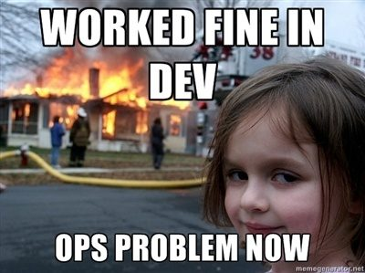

---

开发人员的运行环境和运维、测试、用户的运行环境不一致！

开发人员的运行环境和运维、测试、用户的运行环境不一致！

开发人员的运行环境和运维、测试、用户的运行环境不一致！

---

怎么解决**运行环境不一致**的困局？

# DevOps {id="devopsheading"}

---

* 满足需求和环境多样性、频繁变更带来的**快速响应**能力提升要求是DevOps的发展动力和压力
* 提高软件**可靠性**是DevOps的核心目标

---

## 静态视角看**DevOps**

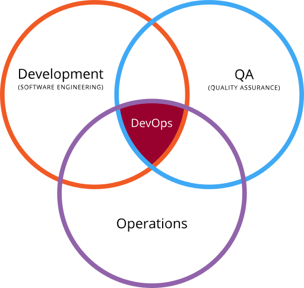

---

## **DevOps**困境

* 开发：追求变化
* 运维：追求稳定
* 测试：追求消灭风险

核心：（不同组织、不同部门、不同角色的）**沟通**问题

---

## 动态（过程）视角看**DevOps**

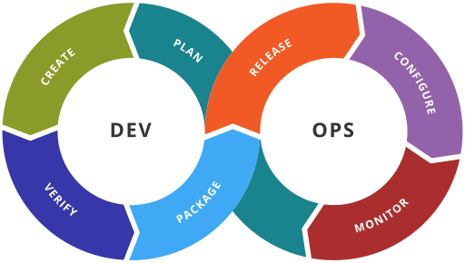

当Dev和Ops是两个人（部门）的时候，需求分析和产品发布阶段会存在大量沟（chĕ）通（pÍ）时间，角色和人员上的二合一可以直接“跳过”沟（chĕ）通（pÍ）阶段

---

## [AWS（Amazon Web Services）的DevOps价值观](https://aws.amazon.com/cn/devops/what-is-devops/)

***DevOps 集文化理念、实践和工具于一身，可以提高组织高速交付应用程序和服务的能力，与使用传统软件开发和基础设施管理流程相比，能够帮助组织更快地发展和改进产品。这种速度使组织能够更好地服务其客户，并在市场上更高效地参与竞争。***


# 为什么要运维自动化？

---


---

假如让你去维护前述已经在“正常工作”的系统，现在需要升级维护其中一个“**老旧**”组件你该怎么下手？

---

你以为的并不是你以为的


---

如果没有自动化运维，你可能在旅途中突然需要这样


---

治大国如烹小虾，我们来类比餐厅老板，看如何实现炒菜的自动化

* 首先，我要知道我的厨房里到底有些什么东西是可用的，比如备了哪些菜，有那些工具，这些就是***配置管理***。
* 此外，我要让系统帮我去做菜，是炒、是炖还是煮？是加水、加油还是加火，这些都是***变更管理***的能力。
* 最后，系统还需要能够知道我炒的菜目前是一个什么样的情况，有几分熟，温度有没有太高，油是不是太少什么的。这些就是***状态管理***的能力。

# 为什么需要持续集成？

---

[下面是程序员日常工作当中惯用的解释，看看你有没有躺枪？](http://coolshell.cn/articles/1174.html)

1. 在我这边的电脑上可以工作啊……
1. 我重来没有听过这样的事
1. **昨天还能正常工作呢**
1. 好吧，这算一个BUG
1. 这怎么可能？
1. 这应该是机器或是环境的问题
1. 操作系统更新了吗？
1. 一定又是用户那边的错
1. 你的测试数据一定有问题
1. 我从来没有碰过那边的代码！

---

* 昨天和今天相比发生了哪些“变化”？
* 这些变化有没有被及时“测试”过？
* 除了**代码**有可能被自己人“变化”了，软件依赖的第三方库、操作系统有没有“悄悄升级”？升级后还能兼容“旧”的代码吗？
* 持续集成可以“尽早暴露”软件和系统可能存在的问题，在正式发布和交付之前可以有机会解决这些问题

# DevOps相关常见术语 {id="devopsjargons"}

---

* 持续集成（Continuous Integration, CI）
* 持续交付（Continuous Delivery, CD）
* 持续部署（Continuous Deployment）
* 上线与回滚
* 灰度发布
* A/B测试

---

## 持续集成

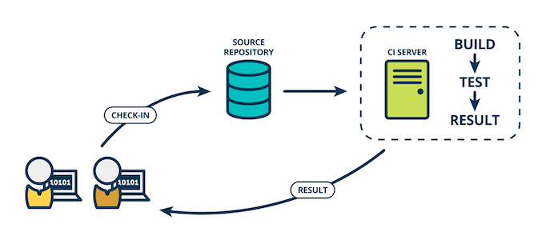

持续集成强调开发人员提交了新代码之后，立刻进行构建、（单元）测试。根据测试结果，开发人员可以确定新代码和原有代码能否正确地集成在一起。

---

## 持续交付

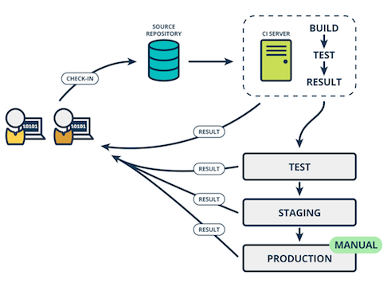

---

持续交付在持续集成的基础上，将集成后的代码部署到更贴近真实运行环境的**类生产环境**（***production-like environments***）中。

比如，开发人员完成单元测试后，可以把代码部署到连接数据库的**模拟**（***Staging***）环境中进行更多的测试。如果代码没有问题，可以继续***<font color='red'>手动</font>部署***到生产环境中。

---

## 持续部署

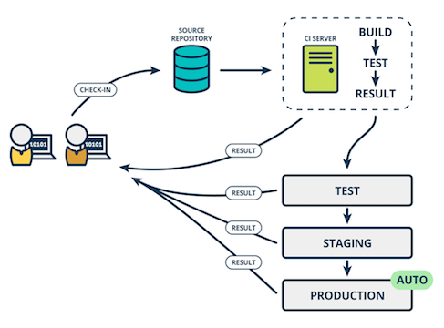

持续部署则是在持续交付的基础上，把部署到生产环境的过程<font color='red'>自动</font>化。

---

## 上线与回滚

* **上线**：这是一种很形象的产品发布过程和结果描述，尤其在互联网、物联网模式流行的今天，客户端-服务器架构是联网软件的主流通信模型。严格来说，本章讨论的**上线**主要指的是服务器软件的**部署**。
* **回滚**：软件在**上线**之后可能会遇到一些严重bug并影响到产品基本功能和用户体验，从应急响应角度出发，往往会使用最近一个被证明可用版本的软件（代码）来替代存在bug的软件。如果这个过程发生在产品刚刚上线，则把这个回退到旧版本软件的操作称为**回滚**。

---

## 灰度发布

* 灰度：把黑色定为基本色，每个灰度对象都是0%（白色）到100%（黑色）的中间值，简而言之，灰度就是不饱和的黑色。
* 灰度发布：是指在黑与白之间，能够平滑过渡的一种发布方式。
    * 以互联网产品为例，只要产品没有被放弃还在继续提供服务，就会不停的升级，升级，再升级。
    * 系统升级总是伴随着风险：新旧版本兼容的风险，用户使用习惯突然改变而造成用户流失的风险，系统down机的风险等等。
        * 为了避免这些风险，很多产品都采用了**灰度发布**的策略，其主要思想就是：把影响集中到一个点，然后再发散到一个面，出现意外情况后很容易就**回滚**。

---

## A/B测试

* A/B测试就是灰度发布的其中一种常用方式，让一部分用户继续用A，一部分用户开始用B，如果用户对B没有什么反对意见，那么逐步扩大范围，把所有用户都迁移到B上面来。

---

* 无论是灰度发布、A/B测试还是正式上线，对于软件的上线和回滚流程来说，以下需求始终存在：
    * 可以追踪和管理上线软件版本，支持不同版本系统对应代码的平滑切换；
    * 在产品（包括灰度发布和正式发布）发布之前能够在一个可信可控环境模拟线上生产环境进行测试；
        * 客户联网环境模拟
        * 多客户端版本共存环境模拟
    * 开发工程师不能直接接触生产环境的用户机密和隐私数据，但又需要给开发和测试环境提供尽可能“真实”的用户数据用于开发调试和发布前测试；

# [滚动更新与固定版本Linux之争](https://linuxstory.org/rolling-release-vs-fixed-release-linux/)

---

* Gentoo Linux 作为最古老的活跃 Linux 发行版本和 Google 的 Chrome OS 的衍生来源版本，它已经采用**滚动更新**（***Rolling Update***）方式近15年了。
    * [Kali Linux从2016年1月开始基于Debian使用滚动更新方式维护升级](https://www.kali.org/news/kali-linux-rolling-edition-2016-1/)
* 固定发行依然是目前面向企业级产品最主要的发行模型。在固定发行中，包含安全更新和小的调整的发行版本是有计划的。
    * Canonical 维护 Ubuntu Linux
    * Red Hat 维护 Red Hat Enterprise Linux (RHEL)
    * SUSE 维护 SUSE Linux Enterprise Server (SLES)

---

* 软件和软件工程本身的复杂性决定了**滚动更新**方式在软件兼容性方面将面临巨大挑战；
* **固定发行**方式的优势就在于可以基于一个相对稳定的代码分支进行***小范围***的修修补补，使得软件的可测试性更好，理论上将提供更好的稳定性。

# 主流技术工具链

---

* git（github/gitlab）
* ansible（puppet、chef、salt等）
* docker（dockerfile/k8s/dockerhub）
* jenkins / travis / Gitlab CI
* openstack（KVM、Xen）
* openvswitch
* tcpreplay + tcpcopy

# git

---

> Git is a free and open source distributed version control system designed to handle everything from small to very large projects with speed and efficiency.

解决代码和文档的版本管理、多人协作开发与编辑需求。

---

## GitLab

> Provides Git repository management, code reviews, issue tracking, activity feeds and wikis. GitLab itself is also free software.

# [ansible](https://www.ansible.com)

---

> Deploy apps. Manage systems. Crush complexity. Ansible helps you build a strong foundation for DevOps.

提供开发、测试和生产环境的软件定义能力，满足代码运行环境一致性、可审计、自动化等需求。

# 分分钟上手Ansible {id="ansible-quickstart"}

---

## 安装Ansible {id="ansible-install"}


```bash
$ sudo apt-get install ansible
```

---

## agentless+push VS. agent+pull

<a href="https://wiredcraft.com/blog/getting-started-with-ansible-in-5-minutes/">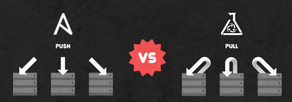</a>
<a href="https://wiredcraft.com/blog/getting-started-with-ansible-in-5-minutes/"></a>

---

[Chef](https://www.chef.io/chef/)和[Puppet](https://puppet.com/)是DevOps领域的另2款重量级解决方案，这2个方案的共同点是采用了：（被管理主机上安装）代理（agent）软件和拉取（pull）模型。代理软件按照预先配置的策略通过私有传输协议从管理主机上拉取配置变更到本地应用。

ansible则采用了截然相反的一种工作模型：**agentless**和**push**。并且，ansible使用SSH通道来实现远程管理和命令执行。

---

[幂等性 Idempotence](https://en.wikipedia.org/wiki/Idempotence): 同一个操作执行两次或更多次不会改变第一次执行的结果。

ansible的大部分命令、模块和操作都能保证上述**幂等性**。

# 体验Ansible {id="ansible-helloworld"}

---

## 体验环境准备

* 两台Virtualbox虚拟机，采用Host-only方式直连
    * 安装ansible的虚拟机我们用A表示，没有安装ansible的虚拟机我们用B表示
    * 假设A的IP：192.168.56.102，B的IP：192.168.56.101
* 使用第一章的普通用户SSH免密登陆配置方法，配置从A到B的普通用户SSH免密登录配置
    * 假设A和B上都有普通用户cuc，且均具有完整sudo权限
* 远程被管理主机上需要安装python2/3

---

```bash
# 配置A->B的root用户免密SSH登录
$ ssh-copy-id -i ~/.ssh/id_rsa.pub cuc@192.168.56.101

# SSH登录到B上手工配置A上cuc用户的RSA公钥到B上root用户的/root/.ssh/authorized_keys
$ ssh cuc@192.168.56.101 
$ sudo mkdir /root/.ssh
$ sudo cp /home/cuc/.ssh/authorized_keys /root/.ssh/authorized_keys
# 假设B上没有安装过python
$ sudo apt-get update && sudo apt-get install -y python-minimal
$ exit

# 继续在A上执行命令
# 验证A->B的root用户免密SSH登录
$ ssh root@192.168.56.101
# exit

# 回到A上继续执行命令
# 创建一个ansible的本地工作目录（可选步骤）
$ mkdir ansible && cd ansible
# hosts文件内容参照/etc/ansible/hosts的内容格式
$ echo -e "[web]\n192.168.56.101" > hosts
$ ansible all -m ping -u root -i hosts
192.168.56.101 | SUCCESS => {
    "changed": false,
    "ping": "pong"
}
```

---

* 上述操作过程中创建的本地hosts文件，在ansible中有一个术语，叫做[inventory](http://docs.ansible.com/ansible/intro_inventory.html)，用来定义可操作的远程主机信息。

# 用ansible来统一安装配置nginx {id="ansible-nginx"}

---

ansible使用[playbooks](http://docs.ansible.com/ansible/playbooks.html)来定义远程管理“脚本”，playbooks使用YAML语法。

[role](http://docs.ansible.com/ansible/playbooks_roles.html)是ansible中用来抽象**可重用**配置脚本的概念。通常一个role中包括[变量](http://docs.ansible.com/ansible/playbooks_variables.html)、[任务](http://docs.ansible.com/ansible/playbooks_intro.html#tasks-list)和[句柄](http://docs.ansible.com/ansible/playbooks_intro.html#handlers-running-operations-on-change)。

[Ansible Galaxy](https://galaxy.ansible.com/)是ansible官方维护的一个role分享社区。通过[在线搜索nginx](https://galaxy.ansible.com/list#/roles?page=1&page_size=10&autocomplete=nginx)，我们可以很快发现这个[mrlesmithjr.nginx](https://galaxy.ansible.com/mrlesmithjr/nginx/)

---

```bash
# 确保你在当前用户可写的目录中
$ mkdir roles
# 以下命令会在当前目录的子目录roles下创建一个名为jeqo.nginx的子目录
$ ansible-galaxy install mrlesmithjr.nginx -p roles
# 可以进入该目录查看自动下载好的一个nginx role（一堆配置文件和ansible脚本）
# 可以 cd roles/mrlesmithjr.nginx 重点查看README.md，获得作者留给我们的第一手帮助文档
# 由于全是脚本，所以文档解决不了的问题可以直接查看代码
```

---

将以下内容粘贴到上述实验中roles的父级目录中新创建的文件，假设文件名为``deploy.yml``

```ini
---
- hosts: web
  become: true
  vars:
  roles:
    - role: mrlesmithjr.nginx
  tasks:
```

```bash
# 把本地的nginx配置“代码”在远程主机上执行起来吧！
$ ansible-playbook deploy.yml -i hosts -u root -v
```

---

验证你的第一个ansible-playbook的成果吧！

```bash
curl http://192.168.56.101
```

---

⛔️ 不要在生产环境或其他重要环境中**盲目**下载执行别人的代码！！！

⛔️ 不要在生产环境或其他重要环境中**盲目**下载执行别人的代码！！！

⛔️ 不要在生产环境或其他重要环境中**盲目**下载执行别人的代码！！！

⚠️  我们**所以**选择在一个***纯净***的虚拟机环境中做上述实验！

---

[番外：Ansible](ansible.md.html)

# [docker](https://www.docker.com/)

---

> Build, Ship, and Run Any App, Anywhere

Docker是一种轻量虚拟化的容器技术，提供类似虚拟机的隔离功能，并使用了一种分层的联合文件系统技术管理镜像，能极大简化环境运维过程。

---

Docker容器云则是使用Docker技术打造的一站式容器云服务平台，即CaaS（Containers as a Service）——容器即服务；可以将它简单看作为PaaS（Platform as a Service）的升级版，使用Docker容器技术的CaaS平台功能更强大，使用灵活，部署更方便。

---

Docker 可以让你像使用集装箱一样快速的组合成应用，并且可以像运输标准集装箱一样，尽可能的屏蔽代码层面的差异。Docker 会尽可能的缩短从代码测试到产品部署的时间。对于DevOps来说，Docker可以提供软件的一致性、可审计和自动化**交付**能力，主动规避软件对操作系统及其运行环境特定版本或组合依赖性或兼容性可能带来的bug。

# 分分钟上手Docker {id="docker-quickstart"}

---

## 安装Docker {id="docker-install"}

以官方文档为准: [https://docs.docker.com/install/linux/docker-ce/ubuntu/](https://docs.docker.com/install/linux/docker-ce/ubuntu/)

```bash
sudo apt-get update

sudo apt-get install apt-transport-https ca-certificates curl software-properties-common

# 导入Docker官方的GPG Key
curl -fsSL https://download.docker.com/linux/ubuntu/gpg | sudo apt-key add -

# 添加Docker官方镜像源地址
sudo add-apt-repository \
   "deb [arch=amd64] https://download.docker.com/linux/ubuntu \
   $(lsb_release -cs) \
   stable"

sudo apt-get update

# 确认你的镜像源配置是正确的：从Docker官网下载安装最新版docker，避免从Ubuntu官方镜像源下载旧版的docker
apt-cache madison docker-ce

# docker-ce | 17.12.0~ce-0~ubuntu | https://download.docker.com/linux/ubuntu xenial/stable amd64 Packages
# docker-ce | 17.09.1~ce-0~ubuntu | https://download.docker.com/linux/ubuntu xenial/stable amd64 Packages
# docker-ce | 17.09.0~ce-0~ubuntu | https://download.docker.com/linux/ubuntu xenial/stable amd64 Packages
#  ...
# docker-ce | 17.03.1~ce-0~ubuntu-xenial | https://download.docker.com/linux/ubuntu xenial/stable amd64 Packages
# docker-ce | 17.03.0~ce-0~ubuntu-xenial | https://download.docker.com/linux/ubuntu xenial/stable amd64 Packages

# 安装docker 
$ sudo apt-get install -y docker-ce

# 检查docker守护进程是否已自动启动
$ sudo systemctl status docker
● docker.service - Docker Application Container Engine
   Loaded: loaded (/lib/systemd/system/docker.service; enabled; vendor preset: enabled)
   Active: active (running) since Wed 2017-02-15 14:44:43 CST; 7min ago
     Docs: https://docs.docker.com
 Main PID: 1464 (dockerd)
    Tasks: 16
   Memory: 50.5M
      CPU: 441ms
   CGroup: /system.slice/docker.service
           ├─1464 /usr/bin/dockerd -H fd://
           └─1622 containerd -l unix:///var/run/docker/libcontainerd/docker-containerd.sock --shim containerd-shim --metrics-interval=0 --sta
```

# Docker基本概念 {id="docker-concepts"}

---

## 虚拟机 VS. 容器

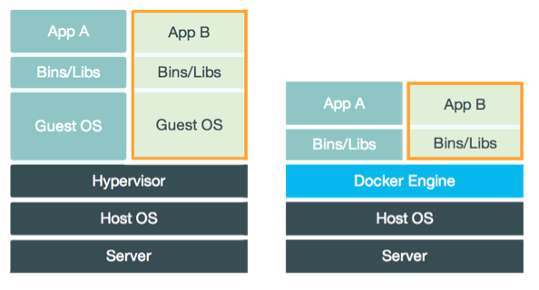

> 注意：Docker只是容器技术目前最“火”的一种，Docker不是容器技术的代名词，只是方案之一。

---

## Linux容器架构 {id="container-arch"}

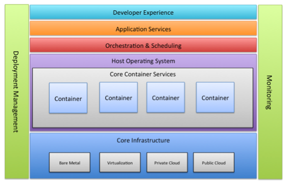

---

## Docker生命周期 {id="docker-lifecycle"}

<a href="https://segmentfault.com/a/1190000000751601">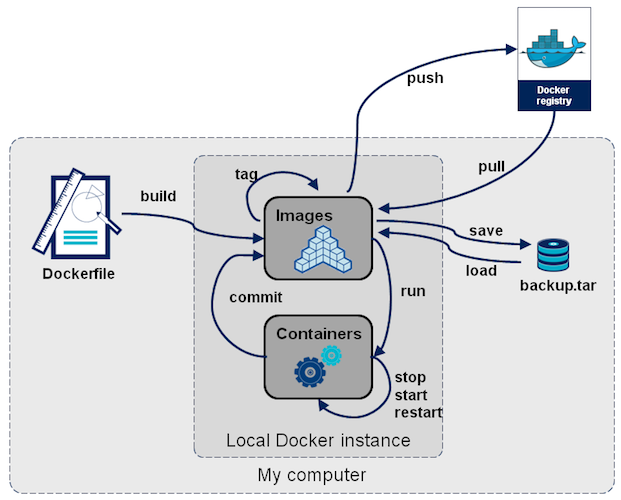</a>

---

## 对象类概念

* [Image](https://docs.docker.com/engine/getstarted/step_two/): 镜像
* Container: 容器
* [Dockerfile](https://docs.docker.com/engine/getstarted/step_four/)
* Local Docker instance
* Docker registry

---

> An ***image*** is a filesystem and parameters to use at runtime. It doesn’t have state and never changes. A ***container*** is a running instance of an image.

镜像可以类比Virtubox的基础镜像概念，容器可以类比Virtubox的差分增量镜像。

> A ***Dockerfile*** is a recipe which describes the files, environment, and commands that make up an image.

Dockerfile可以类比Makefile。

---

Local Docker instance可以类比本地的Virtualbox引擎。

Docker registry相当于git仓库，Docker官方的Docker Hub相当于Github。

---

## 操作类概念

* 类比VS的同名菜单命令（输入是Dockerfile）
    * build
* 类比git的同名子命令
    * [tag](https://docs.docker.com/engine/getstarted/step_six/)
    * commit
    * push
    * pull
* 类比systemd的同名子命令
    * run
    * stop
    * start
    * restart

# 使用命令行控制Docker {id="docker-cli"}

---

```bash
$ sudo docker version
Client:
 Version:	17.12.0-ce
 API version:	1.35
 Go version:	go1.9.2
 Git commit:	c97c6d6
 Built:	Wed Dec 27 20:11:19 2017
 OS/Arch:	linux/amd64

Server:
 Engine:
  Version:	17.12.0-ce
  API version:	1.35 (minimum version 1.12)
  Go version:	go1.9.2
  Git commit:	c97c6d6
  Built:	Wed Dec 27 20:09:53 2017
  OS/Arch:	linux/amd64
  Experimental:	false

$ sudo docker

Usage:	docker COMMAND

A self-sufficient runtime for containers

Options:
      --config string      Location of client config files (default "/home/cuc/.docker")
  -D, --debug              Enable debug mode
  -H, --host list          Daemon socket(s) to connect to
  -l, --log-level string   Set the logging level ("debug"|"info"|"warn"|"error"|"fatal") (default "info")
      --tls                Use TLS; implied by --tlsverify
      --tlscacert string   Trust certs signed only by this CA (default "/home/cuc/.docker/ca.pem")
      --tlscert string     Path to TLS certificate file (default "/home/cuc/.docker/cert.pem")
      --tlskey string      Path to TLS key file (default "/home/cuc/.docker/key.pem")
      --tlsverify          Use TLS and verify the remote
  -v, --version            Print version information and quit

Management Commands:
  config      Manage Docker configs
  container   Manage containers
  image       Manage images
  network     Manage networks
  node        Manage Swarm nodes
  plugin      Manage plugins
  secret      Manage Docker secrets
  service     Manage services
  stack       Manage Docker stacks
  swarm       Manage Swarm
  system      Manage Docker
  trust       Manage trust on Docker images (experimental)
  volume      Manage volumes

Commands:
  attach      Attach local standard input, output, and error streams to a running container
  build       Build an image from a Dockerfile
  commit      Create a new image from a container's changes
  cp          Copy files/folders between a container and the local filesystem
  create      Create a new container
  diff        Inspect changes to files or directories on a container's filesystem
  events      Get real time events from the server
  exec        Run a command in a running container
  export      Export a container's filesystem as a tar archive
  history     Show the history of an image
  images      List images
  import      Import the contents from a tarball to create a filesystem image
  info        Display system-wide information
  inspect     Return low-level information on Docker objects
  kill        Kill one or more running containers
  load        Load an image from a tar archive or STDIN
  login       Log in to a Docker registry
  logout      Log out from a Docker registry
  logs        Fetch the logs of a container
  pause       Pause all processes within one or more containers
  port        List port mappings or a specific mapping for the container
  ps          List containers
  pull        Pull an image or a repository from a registry
  push        Push an image or a repository to a registry
  rename      Rename a container
  restart     Restart one or more containers
  rm          Remove one or more containers
  rmi         Remove one or more images
  run         Run a command in a new container
  save        Save one or more images to a tar archive (streamed to STDOUT by default)
  search      Search the Docker Hub for images
  start       Start one or more stopped containers
  stats       Display a live stream of container(s) resource usage statistics
  stop        Stop one or more running containers
  tag         Create a tag TARGET_IMAGE that refers to SOURCE_IMAGE
  top         Display the running processes of a container
  unpause     Unpause all processes within one or more containers
  update      Update configuration of one or more containers
  version     Show the Docker version information
  wait        Block until one or more containers stop, then print their exit codes

Run 'docker COMMAND --help' for more information on a command.
```

---

## 命令简单分类整理助记

* 容器生命周期管理 — docker [run|start|stop|restart|kill|rm|pause|unpause]
* 容器操作运维 — docker [ps|inspect|top|attach|events|logs|wait|export|port|exec]
* 容器rootfs命令 — docker [commit|cp|diff]
* 镜像仓库 — docker [login|pull|push|search]
* 本地镜像管理 — docker [images|rmi|tag|build|history|save|import]
* 其他命令 — docker [info|version]

---

## 其他需要了解的Docker功能与特性 {id="docker-ecosystem"}

* [Docker虚拟网络的特性与管理](https://docs.docker.com/engine/tutorials/networkingcontainers/)
* [镜像、容器以及宿主机数据管理（共享、隔离等）](https://docs.docker.com/engine/tutorials/dockervolumes/)
* [Docker集群管理](https://www.digitalocean.com/community/tutorials/how-to-create-a-cluster-of-docker-containers-with-docker-swarm-and-digitalocean-on-ubuntu-16-04)
* [Docker生态](https://gigaom.com/report/docker-and-the-current-linux-container-ecosystem/)

# 持续集成与持续部署工具

---

## [jenkins](https://jenkins.io)


> Jenkins is a self-contained, open source automation server which can be used to automate all sorts of tasks such as building, testing, and deploying software.

Jenkins 是被广泛应用的持续集成、自动化测试、持续部署的框架，甚至有些项目组顺便将其用来做流程管理的工具。


---

## [travis](https://travis-ci.org/)

> Test and Deploy Your Code with Confidence

[只支持 GitHub 托管代码](https://docs.travis-ci.com/user/tutorial/)的持续集成服务，同时支持[持续部署到指定的一些第三方云计算平台](https://docs.travis-ci.com/user/deployment/)。

对于 GitHub 上的私有仓库代码，需要付费购买[travis-ci.com](https://travis-ci.com/)的服务。对于 GitHub 上的开源项目代码，可以免费使用 [travis-ci.org](https://travis-ci.org/) ，未来将逐步转向统一由[travis-ci.com](https://travis-ci.com/)继续向 GitHub.com 上的开源项目继续提供免费服务。

---

[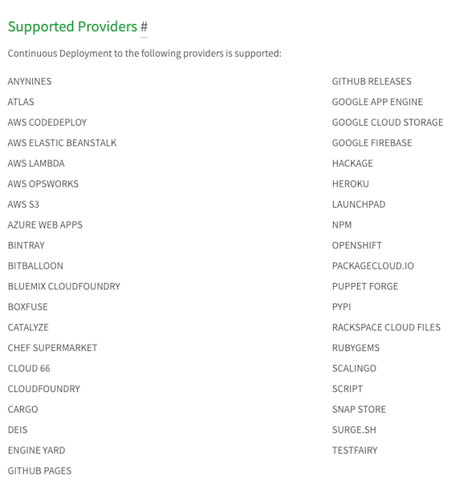](https://docs.travis-ci.com/user/deployment/)

---

🌰

[基于 Travis 的自动构建系统编写的一个在线自动判题系统](https://github.com/c4pr1c3/TravisBasedOJ)

---

### 🌰  单元测试方案选型 {id="unittestcomparison"}

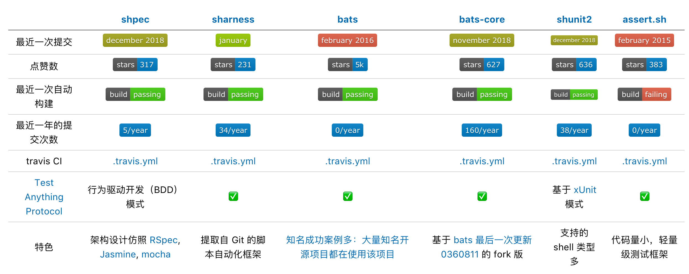

---

| | [shpec](https://github.com/rylnd/shpec/) | [sharness](https://github.com/chriscool/sharness)  | [bats](https://github.com/sstephenson/bats)  | [bats-core](https://github.com/bats-core/bats-core)  | [shunit2](https://github.com/kward/shunit2) | [assert.sh](https://github.com/lehmannro/assert.sh) |
|:--:|:--:|:--:|:--:|:--:|:--:|:--:|
| 最近一次提交 |  |  |  |  |  |  |
| 点赞数 |  |  |  | |  |  |
| 最近一次自动构建 | [](https://travis-ci.org/rylnd/shpec) | [](https://travis-ci.org/chriscool/sharness) | [](https://travis-ci.org/sstephenson/bats) | [](https://travis-ci.org/bats-core/bats-core) | [](https://travis-ci.org/kward/shunit2)  | [](https://travis-ci.org/lehmannro/assert.sh) |
| 最近一年的提交次数 |  |  |  |  |  |   |
| travis CI | [.travis.yml](https://github.com/rylnd/shpec/blob/master/.travis.yml) | [.travis.yml](https://github.com/chriscool/sharness/blob/master/.travis.yml) | [.travis.yml](https://github.com/sstephenson/bats/blob/master/.travis.yml)  | [.travis.yml](https://github.com/bats-core/bats-core/blob/master/.travis.yml)  | [.travis.yml](https://github.com/kward/shunit2/blob/master/.travis.yml) | [.travis.yml](https://github.com/lehmannro/assert.sh/blob/master/.travis.yml) |
| [Test Anything Protocol](https://testanything.org/) | 行为驱动开发（BDD）模式 | ✅ | ✅ | ✅ | 基于 [xUnit](https://en.wikipedia.org/wiki/XUnit) 模式 | ✅ |
| 特色 | 架构设计仿照 [RSpec](https://github.com/rspec/rspec), [Jasmine](https://github.com/jasmine/jasmine), [mocha](https://github.com/mochajs/mocha) |  提取自 Git 的脚本自动化框架 | [知名成功案例多：大量知名开源项目都在使用该项目](https://github.com/sstephenson/bats/wiki/Projects-Using-Bats) | 基于 [bats 最后一次更新 0360811](https://github.com/sstephenson/bats/commit/03608115df2071fff4eaaff1605768c275e5f81f) 的 fork 版 | 支持的 shell 类型多 | 代码量小，轻量级测试框架 |

---

## [Gitlab CI](https://docs.gitlab.com/ce/ci/README.html)

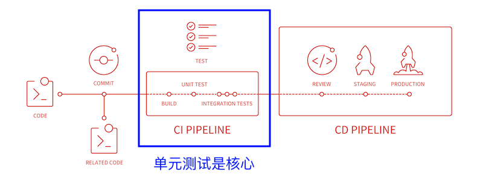

GitLab 内置的持续集成和持续部署功能，开源社区版也可以免费使用该功能。

---

### jenkins / travis / Gitlab CI

| | jenkins | travis | Gitlab CI |
|:--:|:--:|:--:|:--:|
| CI | 支持自定义来源的代码托管仓库 | 仅限 GitHub.com 上托管的代码 | 仅限 GitLab.com 和使用 GitLab 自建仓库托管的代码 |
| CD | 支持自定义部署目标 | [官方指定第三方平台若干](https://docs.travis-ci.com/user/deployment/) | 支持自定义部署目标 |
| docker | ✅ |  ✅ | ✅|
| 自建服务 | ✅ |   ❌  |  ✅  |

# [openstack](https://www.openstack.org/)

---

> OpenStack is a cloud operating system that controls large pools of compute, storage, and networking resources throughout a datacenter, all managed through a dashboard that gives administrators control while empowering their users to provision resources through a web interface.

# [openvswitch](http://openvswitch.org)

---

> Open vSwitch is a production quality, multilayer virtual switch licensed under the open source Apache 2.0 license.  It is designed to enable massive network automation through programmatic extension, while still supporting standard management interfaces and protocols (e.g. NetFlow, sFlow, IPFIX, RSPAN, CLI, LACP, 802.1ag).  In addition, it is designed to support distribution across multiple physical servers similar to VMware's vNetwork distributed vswitch or Cisco's Nexus 1000V. 

# [tcpreplay](http://tcpreplay.synfin.net) + tcpcopy

---

> Tcpreplay is a suite of GPLv3 licensed tools written by Aaron Turner for UNIX (and Win32 under Cygwin) operating systems which gives you the ability to use previously captured traffic in libpcap format to test a variety of network devices. It allows you to classify traffic as client or server, rewrite Layer 2, 3 and 4 headers and finally replay the traffic back onto the network and through other devices such as switches, routers, firewalls, NIDS and IPS's. Tcpreplay supports both single and dual NIC modes for testing both sniffing and inline devices.

一言以蔽之：满足开发和测试环境模拟生产环境真实流量的需求。

---

## 为什么需要模拟生产环境真实流量

* 线下的传统压力测试，难以模拟真实流量，尤其难以模拟正常流量混杂着各色异常流量。所以，线下压得好好的系统，上线后可能某天突然雪崩，说好能支撑 5 倍流量的系统重构，也许流量一翻倍就彻底挂了。
* 系统重构或重要变更上线前，可以拷贝线上真实流量，实时模拟线上流量，甚至可以放大真实流量，进行压力测试，以评估系统承载能力。
* 反过来也可以这样，如果线上跑着跑着发现有性能瓶颈，但线下环境难以复现，可以把真实流量拷贝到线下重放，直到找到问题。

---

## [tcpreplay vs. tcpcopy](http://elastos.org/redmine/attachments/download/425/TCPCopy_Manual\(Chinese\).pdf)

tcpdump+Tcpreplay 或者 wireshark+Tcpreplay 可以用来回放在线流量，这种方案可以解决 TCP 层以下的问题，如防火墙问题，然而，此方案仍有如下缺陷：

---

1. tcpdump 抓在线数据包，必然或多或少影响在线 IO，压力大的时候尤其明显
2. tcpdump 自身会丢包，特别是压力大的时候，丢包会很严重，远远超过 TCPCopy
3. tcpdump 抓的包需要保存下来，必然使其抓的包有限，一般很少抓几天的数据包
4. 利用 Tcpreplay 重放，一般需修改数据包的源 IP 地址，这样必然跟在线环境不一样，对内核协议栈的冲击就很不一样
5. 由于是离线回放，导致 Tcpreplay 回放的时候网络环境可能已经与抓包的时候不同了，Tcpreplay 很难根据不同的环境做相应的调整，从而导致回放的效果与在线会有一定的
6. Tcpreplay 相对 TCPCopy，使用更为复杂

---

[TCPCopy](https://github.com/wangbin579/tcpcopy)主要用来解决 TCP 层及其以上（如 http 协议）的流量复制问题，用于服务器端的流量回放领域。总体来说，TCPCopy 有如下优点：

---

1. TCPCopy 能够对服务器端进行回放，不仅可以离线回放，还可以实时回放
2. TCPCopy 实时复制在线请求包给测试服务器，并不需要大量 IO 操作，因此不影响在线 IO
3. 实时回放所在的网络环境与当时的在线环境几乎是一样的
4. TCPCopy 不会去修改数据包的源 IP 地址
5. TCPCopy 实时复制转发过去的数据包，能够更好地继承在线数据包的网络延迟特征
6. TCPCopy 使用非常简单

# 参考文献

---

* [DevOps from WikiPedia](https://en.wikipedia.org/wiki/DevOps)
* [给 DevOps 初学者的入门指南](https://zhuanlan.zhihu.com/p/22638204)
* [运维自动化闭环，从腾讯走出来的实践](http://blog.dataman-inc.com/117-shurenyun-huodong/)
* [当我们在谈论bug时我们谈论的其实是 by 西乔 神秘的程序员们](http://mp.weixin.qq.com/s?__biz=MzAxMzMxNDIyOA==&mid=206460178&idx=1&sn=54a3382dc4def83d808bc172c012393f&scene=21)
* [docker为什么适合devops？](https://www.zhihu.com/question/46791295)
* [The Product Managers’ Guide to Continuous Delivery and DevOps](http://www.mindtheproduct.com/2016/02/what-the-hell-are-ci-cd-and-devops-a-cheatsheet-for-the-rest-of-us/)
* [How To Install and Use Docker on Ubuntu 16.04](https://www.digitalocean.com/community/tutorials/how-to-install-and-use-docker-on-ubuntu-16-04)

# 番外

---

* 持续进化的软件
    * **可重用**
        * 函数
        * 对象与类
        * lib封装
    * **可分享**
        * 开源软件
    * **可协作**
        * Github
        * Ansible Galaxy
        * Docker Hub

---

Code Defined Software!

Software Defined Everything!

