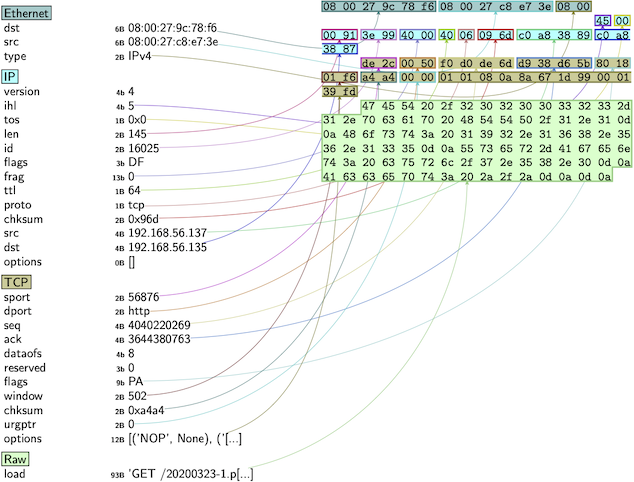
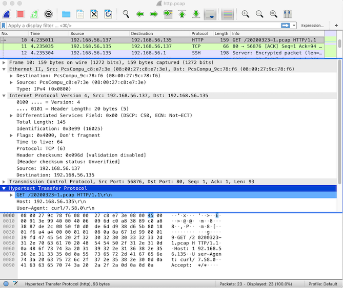

# 《计算机网络》先修基础快速入门

---

> 本课特供无《计算机网络》基础同学

---

> 本课不能代替《计算机网络》课程

---

> 本课仅限服务于《Linux系统与网络管理》课程讲授所需的最小化《计算机网络》概念与技术

# 课程提纲 {id="agenda"}

---

```
I.   分层模型
II.  查表寻址
III. 应用层协议
IV.  网络协议实现离不开操作系统
V.   Virtualbox 虚拟网络实战
```

# I. 分层模型

---

## 本节提纲 {id="agenda-of-1"}

* 对等层通信
* 下层连通是上层连通的基础和保障

---

## 对等层通信

* 「连通性」是针对分层通信模型里具体哪一层的「连通性」，且需要考虑数据传输方向

---

### 4/5 层模型

```
| 应用层 | DHCP | DNS | FTP | NFS | Samba | HTTP |
| 传输层 | TCP  | UDP |
| 网络层 | IP   | ICMP* |
| 数据链路层/物理层 | IEEE 802.3 | IEEE 802.11 | IEEE 802.15 |
```

* IEEE 802.3  以太局域网的物理层和数据链路层标准。
* IEEE 802.11 无线局域网的物理层和数据链路层标准。
* IEEE 802.15 无线个人局域网（包含蓝牙协议）的物理层和数据链路层标准。

---

### 特别的 ICMP

> ICMP 是否属于「网络层」此处存在争议，我在本课程中如无特别说明一律将 ICMP 视为网络层连通性诊断工具。

---

### 对等层通信 FAQ {id="peer-to-peer-faq-1"}

* 本课程涉及到的网络服务配置，无一例外的都是「点对点」 **通信** 模型，即：`「客户端」-「服务器」` 模型，又称 `CS 模型` 。
* 本课程所指的网络服务配置，如无特别说明，都是主要工作在于配置 `「服务器」` 。
* `HTTP` 协议使用的 `「客户端」` 我们通常又称为 `浏览器（Browser）` 。所以，`HTTP` 应用的 **软件架构** 模型又称为 `BS 架构`。
* 典型 `CS 模型` 通信流程：`「客户端」` 发起 **请求** ，`「服务端」` 接收并处理 **请求** 后发回 **响应** 。

---

### 对等层通信 FAQ {id="peer-to-peer-faq-2"}

* 在一次通信过程中，`本地` 是相对于 `远程` 的成对出现概念。例如：
    * SSH 远程登录，运行 `SSH 客户端` 的主机我们称为「本地主机」。`SSH 服务器` 被称为「远程主机」。
    * 使用 HTTP 协议的网站应用中的「文件上传」场景，用户选择「本地」文件上传到「远程」 Web 服务器。
* 每一层的通信 `负载（Payload）` 都指的是「相对于本层的上一层」协议数据。
    * `HTTP 协议数据` 就是通过 TCP 负载层承载的。
* 站在`本地` 看通信：「上行」或「出站」就是向 `远程` ***发送*** 数据，「下行」或「入站」就是从 `远程` ***接收*** 数据。

---

## 分组传输

* 计算机网络通信的「行为模式」特征：`Packet-by-Packet`
* 物理层以上：没有「物理上」的「连接」，只有「逻辑上」的「连接」
    * 每一层「连接」状态的定义存储在「报文」每一层的约定（协议规范）字段
* 研究「连接」的核心是搞懂 `Packet` （报文）分段定义

---

## 报文示例



---



---

## 下层连通是上层连通的基础和保障

---

### 计算机网络连通性故障排查的「自底向上」原则

* 物理层不通，啥都不通。
* 网络层连通，应用层不一定连通。但网络层不连通，应用层一定也不连通。
* 底层自动「寻址」失败时，也会导致应用层连接失败。

---

### 以 SSH 连接失败为例

1. 物理层连通性判定：网卡是否「接入网线」
2. 链路层连通性判定：[`Virtualbox` 虚拟网络连通性矩阵](#vb-net-conn-graph)
3. 网络层连通性判定：`ping`
4. 传输层连通性判定：`nc` / `ssh -vv`
5. 应用层连通性判定：`ssh -vv`

---

### 计算机网络连通性故障排查的「自顶向下」原则

* 用浏览器访问一下网站，能打开已经能说明 HTTP 连接 OK
    * 小心「浏览器缓存」误导
* SSH 已经可以访问目标 IP 所在主机，说明本地到目标 IP 网络层连通性 OK
* `ping` 一下比弯腰查网线更快捷

# II. 查表寻址

---

## 本课程常用查表寻址协议

* DHCP
* ARP
* 路由
* DNS

---

## 网络通信初始化 DHCP

* 解决网络中「新成员」加入后的通信身份标识自动分配问题
* 如果没有 DHCP ，那么需要「手工」配置通信身份标识

---

### 通信身份标识

* 链路层：MAC 地址
* 网络层：IP
* 传输层：协议标识符(TCP/UDP) + 端口号 (1-1024, 1025-65535)
* 应用层：主机名、域名

---

### 接「网」气的 DHCP (1/2)

DHCP 解决的就是「根据主机提供的 **身份标识** 」自动分配一个在局域网中「不会引起 **身份冲突**」的 IP 地址以及其他常用网络配置信息。

---

### 接「网」气的 DHCP (2/2)

* 身份标识：DHCP 请求标识，由本地系统 DHCP 客户端自行决定，常见于直接使用「接入该网络的网卡」的 MAC 地址。也有例外，如 netplan 在大部分主机上使用主机唯一标识符。
* 身份冲突：MAC 地址冲突可能会导致局域网中的流量劫持，IP 地址冲突可能会触发操作系统级别的通信异常处理流程。
* 其他 DHCP 常用配置：局域网网关 IP、本地 DNS 服务器 IP、NTP 服务器 IP 等。


---

## 寻址相关协议

* ARP
* 路由
* DNS

---

### ARP

* 根据目标 IP 地址「查找」目标 MAC 地址。

```bash
# 推荐命令
ip neigh

# ping 一下「局域网」内另一台 VM 后再执行以上命令

# 过时命令
arp -n
```

---

### 路由

* 根据目标 IP 地址「查找」转发「IP」地址。

```bash
# 推荐命令
ip route

# ⚠️  删除虚拟机内默认路由后再执行以上命令 ⚠️
sudo ip route delete default
# 此时还可以 ping 通 www.baidu.com 吗？
# 把之前的默认网关再重新添加进路由表
# sudo ip route add default via 10.0.2.1

# 过时命令
route -n
netstat -rn
```

---

### DNS

* 根据目标「域名」地址「查找」目标「IP」地址。

```bash
# 执行域名解析
## 使用本地默认域名解析服务器
dig www.baidu.com
## 使用指定域名解析服务器 114.114.114.114 忽略 /etc/hosts 
dig @1.1.1.1 www.baidu.com

```


# III. 应用层协议

---

* HTTP （本课程第 5 章：Web服务器）
* FTP / NFS / Samba （本课程第 6 章：网络资源共享）


# IV. 网络协议实现离不开操作系统

---

## 查找表（1/2） { id="lookup-table-1" }

* ARP 表：「目标 IP 地址 -> { 本地网卡标识 - 目标 MAC 地址 } 」映射关系表
* 交换机的 CAM 表：「目标 MAC 地址 - 交换机端口号」映射关系表
* 路由表：「目标 IP 地址段 -> { 本地网卡标识 - 下一跳 IP 地址 - 优先级}」映射关系表

---

## 查找表（2/2） { id="lookup-table-2" }

* DHCP 分配记录：「DHCP 客户端身份标识 -> { 分配 IP 地址 - 租约 }」映射关系表
* DNS：「域名 -> { 地址 [ - 地址类型 - 有效期 ] }」映射关系表
    * `hosts` 文件
    * 应用程序内置缓存，例如浏览器缓存
    * dnsmasq / bind9 等配置文件

---

## 特殊网络地址 { id="special-ip-address"}

---

### 0.0.0.0

* 服务器配置中，指代「本机上的所有网卡可用 IPv4 地址」。例如虚拟机配置的 2 个虚拟网卡分配得到的 IP 分别是 `10.0.2.15` 和 `192.168.56.101` ，则只要满足网络层连通性，这 2 个 IP 地址都可以被用来作为访问时的目的 IP 。
* 路由配置中，指代「默认路由」，表示目标 IP 地址为任意 IPv4 地址。

---

### 127.0.0.1

* 本地「回环（`loopback`）」地址，常用于单机条件下模拟和调试网络程序时的服务端程序监听地址。

---

### localhost

* 主机名，在主流操作系统 `hosts` 文件中通常默认定义为解析到 `127.0.0.1` 或 `::1`，但也可以定义指向其他 IP 地址。

# V. Virtualbox 虚拟网络实战

---

## [Virtualbox 官网的虚拟网络配置详解文档](https://www.virtualbox.org/manual/ch06.html) {id="vb-net-conn-graph"}

连通性总结

| 网卡模式  | VM ➡️  Host | VM ⬅️  Host | VM1<-->VM2 | VM ➡️  Net/LAN | VM ⬅️  Net/LAN | 典型应用场景              |
| ---       | :---:      | :---:      | :---:      | :---:         | :---:         | ---                       |
| Host-only | ✅         | ✅         | ✅         | ❌            | ❌            | Host 访问 VM 内网络服务   |
| NAT-网络  | ✅         | 端口转发   | ✅         | ✅            | 端口转发      | VM 上网且需要 VM 组网实验 |
| NAT       | ✅         | 端口转发   | ❌         | ✅            | 端口转发      | VM 上网                   |
| Internal  | ❌         | ❌         | ✅         | ❌            | ❌            | 网络安全实验              |
| Bridged   | ✅         | ✅         | ✅         | ✅            | ✅            | 借用 Host 物理网卡        |


---

## tcpdump

```bash
# 查看可捕获的网卡名称
tcpdump --list-interfaces

# 对照系统中网卡信息
ip a

# 开始抓包
## -i 指定抓包网卡
## -w 抓包结果保存到文件
sudo tcpdump -i enp0s8 -w http.pcap
```

---

## wireshark

1. 查看抓包基本信息
2. 查看数据包详情
3. 查看「流」信息
4. 从数据流中提取「载荷」

---

### 本章参考文献

- [Virtualbox 官网的虚拟网络配置详解文档](https://www.virtualbox.org/manual/ch06.html)
- [Virtualbox 虚拟网络类型差异可视化详解](https://www.nakivo.com/blog/virtualbox-network-setting-guide/)
- [本人的 Virtualbox 虚拟网络详解（2014年课件）](https://github.com/c4pr1c3/cuc-courses/blob/master/2014_2/VirtualboxNetwork.pdf)

